# Learn Playwright Batch 2x

<div align="center">


**The official course repository for Batch 2x — JavaScript, TypeScript, and Playwright for SDETs**

*Zero to automation hero — JavaScript fundamentals → TypeScript → Playwright → AI Agents & MCP*

[Quick Start](#-quick-start) · [Curriculum](#-curriculum-roadmap) · [Weekly Plan](#-weekly-plan) · [What You'll Build](#-what-youll-build) · [Resources](#-resources)

</div>

---

> **🔄 Repo restructured:** Flat chapter folders replaced by tiered categories (see [📂 Repository Structure](#-repository-structure)). Files keep original lesson numbers. Run commands updated with new paths — if something looks off, open an issue.

---

## Welcome to Batch 2x

This repository is your **week-by-week course companion** for the LearnPlaywright Batch 2x cohort by [The Testing Academy](https://thetestingacademy.com). Code shown in lectures lands here so you can read it, run it, and practice on it.

> Content gets added **as we progress through the batch** — so check back after every class.

### What you'll learn

- **JavaScript Fundamentals** — variables, control flow, arrays, functions, OOP, async
- **TypeScript** — types, interfaces, enums, generics, access modifiers, decorators
- **Playwright** — setup, locators, assertions, fixtures, POM, debugging, CI
- **Modern QA** — Playwright CLI, AI Agents, and MCP for full STLC automation

---

## 🗺️ Curriculum Roadmap

```mermaid
graph TB
    subgraph root["LearnPlaywrightBatch2x"]
        direction TB

        subgraph js["📘 JavaScript (Weeks 1–6)"]
            ch1["Ch 1: Basics ✅"]
            ch2["Ch 2: JS Concepts ✅"]
            ch3["Ch 3: Identifiers & Literals ✅"]
            ch4["Ch 4: var / let / const & Hoisting ✅"]
            ch5["Ch 5: Literals (null, number, string, template) ✅"]
            ch6["Ch 6: Operators ✅"]
            ch7["Ch 7: If / Else ✅"]
            ch8["Ch 8: Switch ✅"]
            ch9["Ch 9: User Input ✅"]
            ch10["Ch 10: Loops ✅"]
            ch11["Ch 11: Arrays ✅"]
            ch12_fn["Ch 12: Functions ✅"]
        end

        subgraph adv["⚙️ Advanced JS (Weeks 7–8)"]
            adv1["Ch 12: Objects"]
            adv2["Ch 13: 2D Arrays"]
            adv3["Ch 14: Callbacks"]
            adv4["Ch 15: Promises"]
            adv5["Ch 16: Async / Await"]
            adv6["Ch 17: OOP - Classes"]
            adv7["Ch 18: Inheritance"]
        end

        subgraph ts["🟦 TypeScript (Week 9)"]
            ts1["Ch 19: TS Fundamentals"]
            ts2["Ch 20: Interfaces"]
            ts3["Ch 21: Enums"]
            ts4["Ch 22: Generics"]
            ts5["Ch 23: Access Modifiers & Decorators"]
        end

        subgraph pw["🎭 Playwright (Weeks 10–12)"]
            pw1["Ch 24: PW Fundamentals"]
            cli["Lecture: Playwright CLI"]
            ai["Lecture: AI Agents"]
            mcp["Lecture: MCP Protocol"]
        end

        subgraph extras["🎯 Bonus"]
            tasks["Interview Coding Questions"]
            tests["Real-world Test Projects"]
        end
    end

    js --> adv --> ts --> pw --> extras

    style js fill:#e1f5fe,stroke:#01579b
    style adv fill:#fff3e0,stroke:#e65100
    style ts fill:#e0f7fa,stroke:#00838f
    style pw fill:#f3e5f5,stroke:#7b1fa2
    style extras fill:#e8f5e9,stroke:#2e7d32
```

---

## 📂 Repository Structure

```
PLAYWRIGHT_LEARNING/
│
├── 01-javascript-basics/               # JavaScript fundamentals
│   ├── 01-introduction/                # Hello World, env setup
│   ├── 02-variables-hoisting/          # var/let/const, TDZ, scope
│   ├── 03-literals-data-types/         # null, number, string, template
│   └── 04-operators/                   # arithmetic, comparison, logical
│
├── 02-control-flow/                    # Program flow
│   ├── 01-conditionals/                # if/else, switch
│   ├── 02-user-input/                  # readline, prompt-sync
│   └── 03-loops/                       # for, while, do-while
│
├── 03-data-structures/                 # Core data structures
│   ├── 01-arrays/                      # creation, methods, iteration
│   ├── 02-strings/                     # properties, search, transform
│   ├── 03-objects/                     # creation, spread, get/set
│   └── 04-2d-arrays/                   # nested arrays, patterns
│
├── 04-functions/                       # Functions deep dive
│   │                                  # declarations, expressions, arrow,
│   │                                  # closure, IIFE, spread, scope
│
├── 05-asynchronous-js/                 # Async programming
│   ├── 01-callbacks/                   # sync, async, callback hell
│   ├── 02-promises/                    # then/catch, Promise.all
│   └── 03-async-await/                 # async/await, parallel, sequential
│
├── 06-playwright-automation/           # Playwright testing
│   │                                  # config, tests, playwright tasks
│
├── 07-typescript-oop/                  # TypeScript & OOP
│   ├── 01-typescript-basics/           # modules, exports, utils
│   ├── 02-classes-objects/             # (coming soon)
│   ├── 03-encapsulation/               # (coming soon)
│   ├── 04-inheritance/                 # (coming soon)
│   ├── 05-polymorphism/                # (coming soon)
│   └── 06-oop-interview-questions/     # (coming soon)
│
├── 08-practice-tasks/                  # Daily coding tasks
│                                      # may/june task solutions
│
├── interview.md                        # JS interview notes
└── README.md                           # 👋 You are here
```

> **Note:** This repo was restructured from 25 flat chapter directories into 8 tiered categories. Files retain their original lesson numbers (1–167) for cross-reference.

> **Legend:** ✅ Done · 🚧 Coming soon

---

## 🚀 Quick Start

### Prerequisites

| Tool | Version | Purpose |
|------|---------|---------|
| **Node.js** | 18+ (LTS recommended) | Runs all `.js` files |
| **npm** | Bundled with Node | Package manager |
| **VS Code** | Latest | Recommended editor |
| **Git** | Latest | Clone the repo |

### Setup

```bash
# 1. Clone the repository
git clone https://github.com/PramodDutta/LearnPlaywrightBatch2x.git
cd LearnPlaywrightBatch2x

# 2. Verify your setup
node "01-javascript-basics/01-introduction/3-jsverify-setup.js"

# 3. Run your first JS program
node "01-javascript-basics/01-introduction/1-basic.js"
```

### Verify it works

```bash
$ node "01-javascript-basics/01-introduction/1-basic.js"
Hello The Testing Academy
```

If you see that line, you're all set! 🎉

---

## 📅 Weekly Plan


| Week | Topic | Chapters | Outcome |
|:----:|-------|---------:|---------|
| 1 | JS Basics & Setup | Ch 1 | Run Node, write first JS |
| 2 | Variables & Hoisting | Ch 2 | Master `var`/`let`/`const` |
| 3 | Identifiers, Literals, Operators | Ch 3–4 | Read/write any expression |
| 4 | Control Flow | Ch 5–7 | If/else, switch, loops |
| 5 | Arrays & Functions | Ch 8–9 | Manipulate data confidently |
| 6 | Strings & Objects | Ch 10–11 | Use JS data structures |
| 7 | Async (Callbacks → Promises) | Ch 12–14 | Handle async work |
| 8 | Async/Await + OOP | Ch 15–17 | Modern async, classes |
| 9 | TypeScript | Ch 18–22 | Type-safe automation code |
| 10 | Playwright Fundamentals | Ch 23 | First passing test |
| 11 | Playwright CLI Mastery | CLI Lecture | Codegen, debug, trace |
| 12 | AI Agents + MCP | AI/MCP Lectures | Self-healing, full STLC |

---

## 🧭 Learning Flow

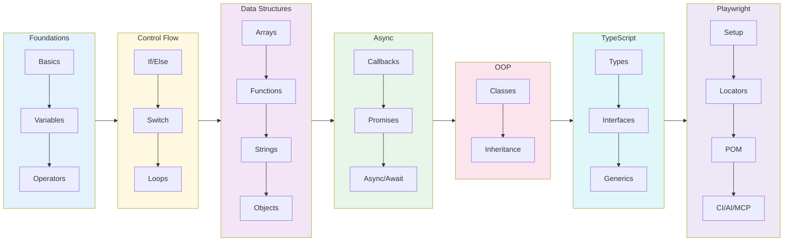

---

## 📖 What's in Chapter 1 (Available Now)

### Files

| File | Topic | What you'll learn |
|------|-------|-------------------|
| `01_Basics.js` | Hello World | First `console.log`, declaring a variable |
| `02_JS.js` | Variables & Loops | Re-declaring with `let`, calling functions inside loops |
| `03_JS_Verify_Setup.js` | Environment Check | `process.platform`, `process.arch`, `process.version` |
| `04_HotCode.js` | Hot Code Paths | How V8 optimizes frequently-called functions |

### Key Concepts

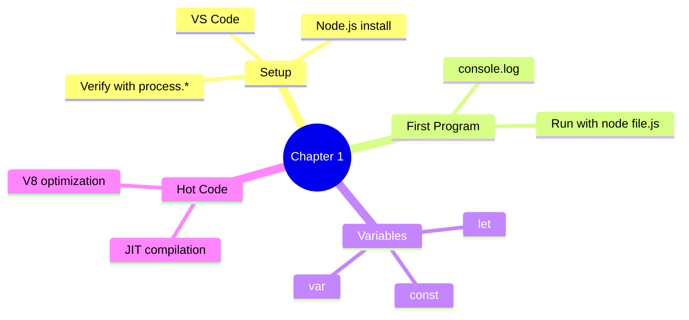

### Run them

```bash
node "01-javascript-basics/01-introduction/1-basic.js"             # → "Hello The Testing Academy"
node "01-javascript-basics/01-introduction/2-js.js"                # → counts to 100000 calling print()
node "01-javascript-basics/01-introduction/3-jsverify-setup.js"    # → prints platform / arch / node version
node "01-javascript-basics/01-introduction/4-hotcode.js"           # → triggers V8 hot-path optimization
```

---

## 📖 What's in Chapter 2 (Available Now)

### Files

| File | Topic | What you'll learn |
|------|-------|-------------------|
| `05_JS_Basics.js` | JS Basics | Variables, assignment, console output |

---

## 📖 What's in Chapter 3 (Available Now)

### Files

| File | Topic | What you'll learn |
|------|-------|-------------------|
| `06_Identifier_Rules.js` | Identifier Rules | Valid names (`$`, `_`, camelCase) |
| `07_Identifier_Part2.js` | Naming Conventions | camelCase, PascalCase, snake_case, SCREAMING_SNAKE_CASE |
| `08_Comments.js` | Comments | Single-line, multi-line & JSDoc style |
| `js_identifier_rules.js` | Reference | Quick identifier rules cheat-sheet |
| `VS_Code_keyboard_shortcut_mac.md` | Shortcuts | VS Code keyboard shortcuts for macOS |
| `VS_Code_keyboard_shortcut_windows.md` | Shortcuts | VS Code keyboard shortcuts for Windows |

### Key Concepts

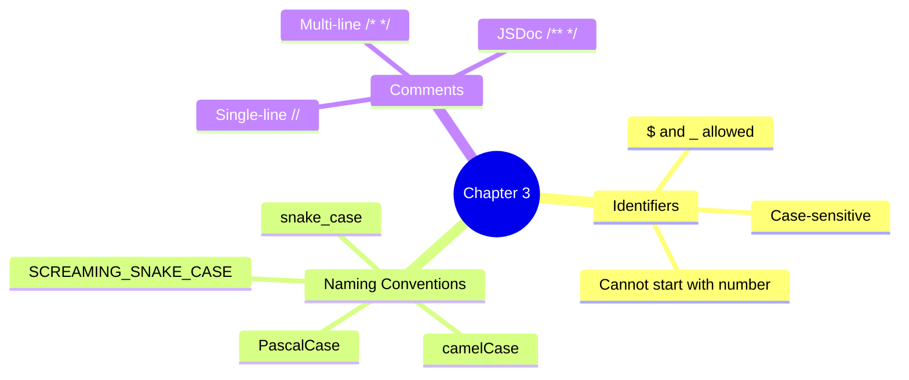

---

## 📖 What's in Chapter 4 (Available Now)

### Files

| File | Topic | What you'll learn |
|------|-------|-------------------|
| `09_var_let_const.js` | var, let, const | Declaration, re-declaration, reassignment |
| `10_functions.js` | Functions | Declaring and calling functions |
| `11_var_explained.js` | var Deep Dive | How `var` works in loops & functions |
| `12_let_peope_love.js` | let Deep Dive | Block-scoped `let` behavior |
| `13_const_explained.js` | const Deep Dive | Immutable bindings with `const` |
| `14_var_functionscope.js` | Function Scope | `var` scoped to functions |
| `15_let_scope.js` | Block Scope | `let` scoped to blocks `{}` |
| `16_Hoisting.js` | Hoisting | Variable hoisting & `undefined` |
| `17_hoisting_fn.js` | Function Hoisting | How function declarations are hoisted |
| `18_let_hoisting.js` | let TDZ | Temporal Dead Zone — why `let` errors before declaration |
| `19_let_hoisting_block.js` | Block TDZ | Inner-block `let` does **not** inherit outer value |
| `20_let_const.js` | const Hoisting | `const` is hoisted too — same TDZ rules apply |
| `21_Jr_QA.js` | Interview Q&A | Classic TDZ trap with `const` (junior SDET quiz) |

### Key Concepts

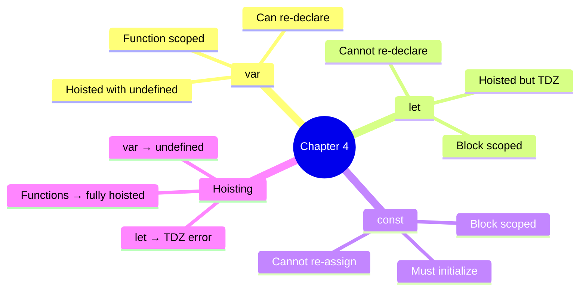

### Run them

```bash
node "01-javascript-basics/02-variables-hoisting/9-va-let-hoist.js"    # → var, let, const behavior
node "01-javascript-basics/02-variables-hoisting/16-hoisting.js"       # → see hoisting in action
node "01-javascript-basics/02-variables-hoisting/18-let-hoisting.js"   # → throws TDZ ReferenceError
node "01-javascript-basics/02-variables-hoisting/21-jr-qa.js"          # → interview-style TDZ trap
```

### 18 — Temporal Dead Zone (TDZ)

**Concept:** TDZ is the window between when a `let`/`const` is hoisted to the top of its block and when its declaration line is actually reached. Inside that window any read or write throws `ReferenceError: Cannot access 'x' before initialization`.

**Why:** Catches use-before-declare bugs at the source — unlike `var`, which silently returns `undefined` and hides the bug until runtime.

**Q&A — why use this?**
- **Q: Are `let` and `const` really hoisted?** A: Yes — but to a "not yet usable" state. The binding exists; the value does not. That gap is the TDZ.
- **Q: How is this different from `var`?** A: `var` is hoisted **and** initialized to `undefined` immediately. `let`/`const` are hoisted but uninitialized — touching them = ReferenceError.
- **Q: Why does the interview question with `const c` throw?** A: The `console.log(c)` runs **inside** the TDZ of `const c = "pramod"`. Hoisting is not "no declaration"; it's "declaration parked, value not yet set".

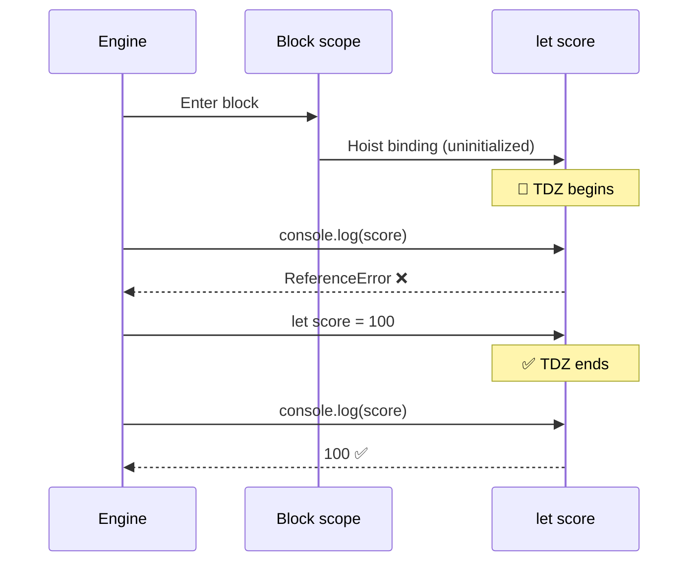

```js
// 18_let_hoisting.js — TDZ in action
console.log(score); // ❌ ReferenceError: Cannot access 'score' before initialization
let score = 100;

{
    // ---- TDZ for inner "score" starts ----
    // console.log(score);  // ❌ ReferenceError
    // typeof score;        // ❌ ReferenceError (!! typeof normally never throws)
    let score = 100;        // ✅ TDZ ends here
    console.log(score);     // 100
}
```

| Trap | `var` | `let` / `const` |
|:-----|:-----:|:---------------:|
| Read before declaration | `undefined` | **ReferenceError** |
| Re-declare in same scope | ✅ allowed | ❌ SyntaxError |
| Scope | Function | Block `{}` |
| Hoisted? | ✅ + initialized | ✅ but in TDZ |

---

## 📖 What's in Chapter 5 — Literals (Available Now)

### Files

| File | Topic | What you'll learn |
|------|-------|-------------------|
| `22_Literal.js` | Literals + `typeof` | String, number, boolean, null, undefined literals |
| `23_null_undefined.js` | null vs undefined | Who sets them, when to use which, the `typeof null === 'object'` quirk |
| `24_null.js` | Empty values | `null`, `undefined`, `""`, `0` — same role, different types |
| `25_Literal_All.js` | All literals | Whirlwind tour of every literal form |
| `26_Literal_Number_all.js` | Number literals | Decimal, binary `0b`, octal `0o`, hex `0x`, BigInt `n`, `1e6`, `1_000_000`, `NaN`, `Infinity` |
| `27_String.js` | Quotes | Single `'…'` vs double `"…"` strings (interchangeable) |
| `28_Template_Literal.js` | Backticks | `` `${var}` `` interpolation — Playwright selectors, log lines, screenshot paths |
| `29_Backtick_single_double.js` | `'` vs `"` vs `` ` `` | One-page comparison + migration from `+`-concatenation |

### Key Concepts

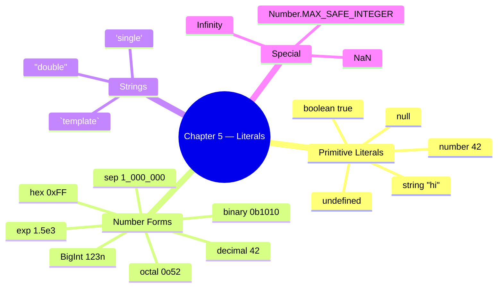

### Run them

```bash
node "01-javascript-basics/03-literals-data-types/22-literal.js"              # → typeof for each literal
node "01-javascript-basics/03-literals-data-types/23-null-undefined.js"       # → null vs undefined walkthrough
node "01-javascript-basics/03-literals-data-types/26-literal-number-all.js"   # → every number literal form
node "01-javascript-basics/03-literals-data-types/28-template-literal.js"     # → backtick interpolation
```

---

### 22 — What is a Literal?

**Concept:** A *literal* is a value written **directly** in source code — `42`, `"hello"`, `true`, `null`. It's the raw value, not a variable referring to one.

**Why:** Every value in a JS program either comes from a literal you typed or was derived from one. Knowing the literal forms = knowing the JS type system.

**Q&A — why use this?**
- **Q: Why does `typeof null` return `"object"`?** A: 26-year-old JavaScript bug — preserved for backwards compatibility. Test against `null` with `value === null`, never `typeof`.
- **Q: Is `undefined` a literal?** A: Practically yes, but it's actually a property of the global object. Never assign `undefined` manually — let JS produce it.
- **Q: Why does `typeof` on a never-declared variable not throw?** A: `typeof` is the **only** operator that's TDZ-safe for *undeclared* identifiers. Returns `"undefined"`. (But TDZ for `let`/`const`? Still throws — see Ch 4.)

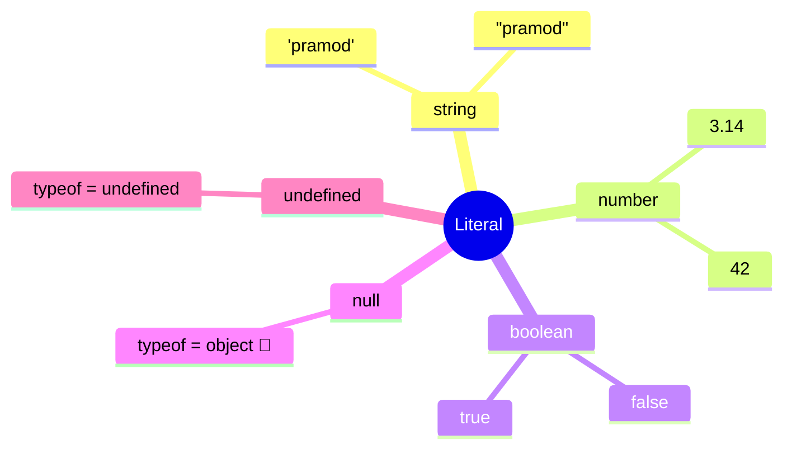

```js
// 22_Literal.js
let age = "pramod";        // string literal
let isStudent = true;      // boolean literal
let pi = 3.14;             // number literal
let nullValue = null;      // null literal
let undefinedValue;        // implicitly undefined

console.log(typeof age);            // "string"
console.log(typeof pi);             // "number"
console.log(typeof isStudent);      // "boolean"
console.log(typeof nullValue);      // "object"   ← JS bug, kept forever
console.log(typeof undefinedValue); // "undefined"
```

---

### 23 — null vs undefined

**Concept:** Both mean "no value", but: `undefined` = JS set it (uninitialized, missing return); `null` = developer set it on purpose ("explicitly empty").

**Why:** Mixing them up causes 90% of "Cannot read properties of undefined" bugs in test code — knowing which to expect tells you whether the bug is in your code or the SUT.

**Q&A — why use this?**
- **Q: When should *I* assign `null`?** A: When you want to deliberately **clear** a reference (`user = null`) or signal "intentionally empty". Never reach for `undefined` — let JS produce it.
- **Q: `null == undefined` → ?** A: `true` with `==`, `false` with `===`. Always use `===` to keep them distinct in test assertions.
- **Q: Playwright API returns null — what does that mean?** A: "Element/value asked for does not exist." Returns `undefined` → "API wasn't called" or "property missing". Different bug categories.

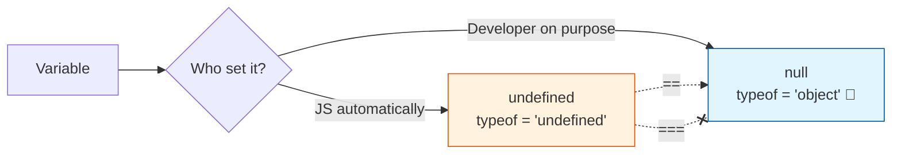

```js
// 23_null_undefined.js
let userName;                         // JS sets it
console.log(userName);                // undefined
console.log(typeof userName);         // "undefined"

let profilePicture = null;            // developer sets it
console.log(profilePicture);          // null
console.log(typeof profilePicture);   // "object"  ← classic JS quirk

let a;
let b = null;
console.log(a == b);   // true  ← loose equality
console.log(a === b);  // false ← strict equality (different types)
```

| | `undefined` | `null` |
|:-:|:-:|:-:|
| Set by | JavaScript | Developer |
| `typeof` | `"undefined"` | `"object"` (bug) |
| Use case | "Not initialized yet" | "Cleared on purpose" |
| Assertion in tests | `expect(x).toBeUndefined()` | `expect(x).toBeNull()` |

---

### 26 — Number Literals (every form)

**Concept:** JS has one `number` type (IEEE-754 double) — but many ways to *write* a number: decimal, binary `0b`, octal `0o`, hex `0x`, exponential `1.5e3`, separators `1_000_000`, and `BigInt` (`123n`) for huge integers.

**Why:** Choosing the right literal form makes code self-documenting — `0xFF` says "byte mask", `0b1010_0001` says "bit flags", `1_000_000` says "one million, not ten thousand".

**Q&A — why use this?**
- **Q: When do I need BigInt?** A: When values exceed `Number.MAX_SAFE_INTEGER` (`2^53 - 1` = `9007199254740991`). Common in timestamps-with-nanoseconds, blockchain IDs, large DB IDs.
- **Q: `0 / 0` returns?** A: `NaN`. And `typeof NaN === "number"` (yes, really). Test with `Number.isNaN(x)` — **not** `x === NaN` (which is always `false`).
- **Q: Why is `0.1 + 0.2 !== 0.3`?** A: IEEE-754 float rounding. Compare with `Math.abs(a - b) < Number.EPSILON` for currency, or store cents as integers.

```mermaid
mindmap
  root((number))
    Integer
      decimal 42
      binary 0b1010
      octal 0o52
      hex 0x2A
    Float
      3.14
      1.5e3
      1.5e-3
    Readable
      1_000_000
      0xFF_FF
    BigInt
      123n
      BigInt&#40;42&#41;
    Special
      Infinity
      -Infinity
      NaN
```

```js
// 26_Literal_Number_all.js
let decimal = 42;
let binary  = 0b1010;          // 10
let octal   = 0o52;            // 42
let hex     = 0x2A;            // 42
let exp     = 1.5e3;           // 1500
let million = 1_000_000;       // 1000000 (ES2021 separator)
let big     = 123456789012345678901234567890n; // BigInt

console.log(1 / 0);                          // Infinity
console.log(0 / 0);                          // NaN
console.log(typeof NaN);                     // "number"
console.log(Number.MAX_SAFE_INTEGER);        // 9007199254740991
```

---

### 28 — Template Literals (Backticks)

**Concept:** A string wrapped in backticks `` ` `` that supports `${expression}` interpolation and real multi-line text — no `+` concatenation, no `\n` escapes.

**Why:** Building Playwright selectors, log lines, dynamic API URLs, and screenshot paths from variables is **everywhere** in test code. Template literals are the cleanest way to do it.

**Q&A — why use this?**
- **Q: When should I prefer backticks over `'…'` / `"…"`?** A: Any string with a variable inside, any multi-line string, any string with an embedded expression. Plain text? Either is fine — be consistent.
- **Q: Can I run code inside `${…}`?** A: Yes — any JS expression: `` `${a + b}` ``, `` `${user.toUpperCase()}` ``, `` `${Date.now()}` ``. Statements (if/for) don't fit, but ternaries do.
- **Q: Do backticks work in JSON?** A: No — JSON only allows `"…"`. Use backticks to **build** the JSON string in JS, then send it.

```mermaid
flowchart LR
    A[rowIndex = 3] --> T["`[data-row=&dollar;{rowIndex}]`"]
    B[columnName = 'email'] --> T
    T --> P[page.locator&#40;…&#41;]
    P --> C[Click cell]
    style T fill:#fff3e0,stroke:#e65100
```

```js
// 28_Template_Literal.js — typical Playwright/test-code use
const rowIndex = 3;
const columnName = "email";
await page.locator(`[data-row="${rowIndex}"] [data-col="${columnName}"]`).click();

const testName = "Login Test";
const status = "FAILED";
const duration = 2.3;
console.log(`[${status}] ${testName} completed in ${duration}s`);

const testCase = "checkout_flow";
const timestamp = Date.now();
await page.screenshot({ path: `screenshots/${testCase}_${timestamp}.png` });
```

| Need | `'…'` / `"…"` | `` `…` `` |
|:-----|:-:|:-:|
| Plain text | ✅ | ✅ |
| `${variable}` interpolation | ❌ | ✅ |
| Multi-line without `\n` | ❌ | ✅ |
| Expression `${a + b}` | ❌ | ✅ |
| JSON-compatible | ✅ | ❌ |

---

## 📖 What's in Chapter 6 — Operators (Available Now)

### Files

| File | Topic | What you'll learn |
|------|-------|-------------------|
| `30_Operator.js` | Assignment | `=` puts the right-hand value into the left-hand binding |
| `31_Arithmetic_OP.js` | Arithmetic | `+`, `-`, `*`, `/` on numbers |
| `32_Modulus_OP.js` | Modulus | `%` remainder — odd/even check (`n % 2 === 0`) |
| `33_Expo_OP.js` | Exponentiation | `**` power (`2 ** 3 === 8`) |
| `34_IQ.js` | Compound | `+=`, `-=`, `*=`, `/=`, `%=` shorthand |
| `35_Comparsion_OP.js` | Comparison | `>`, `<`, `>=`, `<=`, `==`, `===`, `!=`, `!==` → boolean |
| `36_Comparsion_Strict_loose.js` | Loose vs strict | Why `42 == "42"` is `true` but `42 === "42"` is `false` |
| `37_IQ_Loose_Strict.js` | Interview quick-fire | `0 == ""`, `0 == "0"`, `"" == "0"` — transitivity broken |
| `38_Confusing_Comparsion.js` | 🔥 == vs === | NaN, `[]`, `null`/`undefined`, `typeof null`, `[] == ![]` |
| `39_Logical_Op.js` | Logical | `&&`, `\|\|`, `!` on booleans |
| `40_String_Con_Op.js` | String concat | `+` on strings glues them (`"Hi" + " Dev"`) |
| `41_Ternary_Op.js` | Ternary `? :` | One-line `if/else` — SLA checks, env-based URLs, nested ternaries |
| `42_Type_Op.js` | `typeof` | Type tag for any value (`"string"`, `"number"`, `"object"`, `"undefined"`) |
| `43_Incre_Decre_Op.js` | `++` / `--` | Pre vs post increment/decrement — when each is evaluated |
| `44_Null_Op.js` | Nullish `??` | Fallback **only** for `null`/`undefined` (unlike `\|\|`) |
| `45_Post_Increment.js` | Post `++` | `a++` returns old value, then increments |
| `46_IQ_INCREMENT_D.js` | Interview Q | What does `let r = a++` log? |
| `47_Advance_ID_.js` | 🔥 IQ Trap | `++a + ++a` — read-modify-write order in one expression |

### Key Concepts

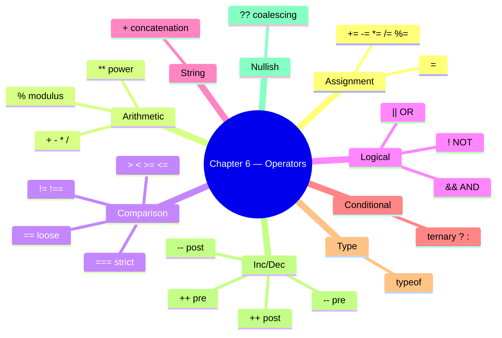

### Run them

```bash
node "01-javascript-basics/04-operators/30-operator.js"         # → assignment operator
node "01-javascript-basics/04-operators/31-arithmetic-op.js"    # → sum, sub, mul, div
node "01-javascript-basics/04-operators/32-modulus-op.js"       # → 13 % 7, odd/even via % 2
node "01-javascript-basics/04-operators/33-expo-op.js"          # → ** exponentiation
node "01-javascript-basics/04-operators/34-iq.js"               # → compound assignment
node "01-javascript-basics/04-operators/35-comparison-op.js"    # → comparison operators
```

---

### 30 — Operators Overview (Assignment, Arithmetic, Modulus, Exponent, Compound)

**Concept:** Operators take 1–2 values and return a new value. Assignment writes a binding (`=`); arithmetic does math (`+ - * / % **`); compound combines both (`x += 3` = `x = x + 3`).

**Why:** Every expression in a JS program is built from operators — count loops, totals, percentages, screenshot filenames with `+`, test data math. Get the precedence wrong and the assertion is wrong.

**Q&A — why use this?**
- **Q: What's `%` actually for in tests?** A: Even/odd row striping (`i % 2 === 0`), every-Nth iteration (`i % 10 === 0` → log progress), modular bucketing of test data.
- **Q: Why prefer `x += 1` over `x = x + 1`?** A: One read of `x`, one write — same outcome, fewer keystrokes, and `+=` works on strings too (`s += " more"`).
- **Q: Is `**` the same as `Math.pow`?** A: Same numeric result. `**` is the operator (ES2016+), `Math.pow(2, 3)` is the legacy function. Prefer `**`.

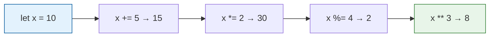

```js
// 31, 32, 33, 34 — combined
let a = 10, b = 3;
console.log(a + b);        // 13
console.log(a - b);        // 7
console.log(a * b);        // 30
console.log(a / b);        // 3.333...
console.log(a % b);        // 1   ← remainder
console.log(2 ** 10);      // 1024

// Compound assignment — same x, mutated step by step
let x = 10;
x += 10;  // 20
x -= 3;   // 17
x *= 2;   // 34
x /= 17;  // 2
x %= 2;   // 0
console.log(x);            // 0
```

---

### 35 — Comparison: `==` vs `===`

**Concept:** Comparison operators return `true`/`false`. `==` (loose) coerces types before comparing — `42 == "42"` is `true`. `===` (strict) requires same type AND same value — `42 === "42"` is `false`.

**Why:** 90% of mystery test failures around equality are caused by accidental loose equality. Strict (`===`) is the safe default; loose (`==`) is reserved for one specific trick.

**Q&A — why use this?**
- **Q: When is `==` ever the right choice?** A: One case only — `if (x == null)` matches both `null` and `undefined` in one shot. Everywhere else use `===`.
- **Q: Is `>=` strict or loose?** A: `>=`, `<=`, `>`, `<` always coerce — there is no strict version. That's why `null >= 0` is `true` even though `null == 0` is `false`.
- **Q: Why does Playwright's `expect()` not have this problem?** A: It compares with deep strict equality internally — but **your** code outside `expect()` (filters, IDs, conditions) is where `==` bites you.

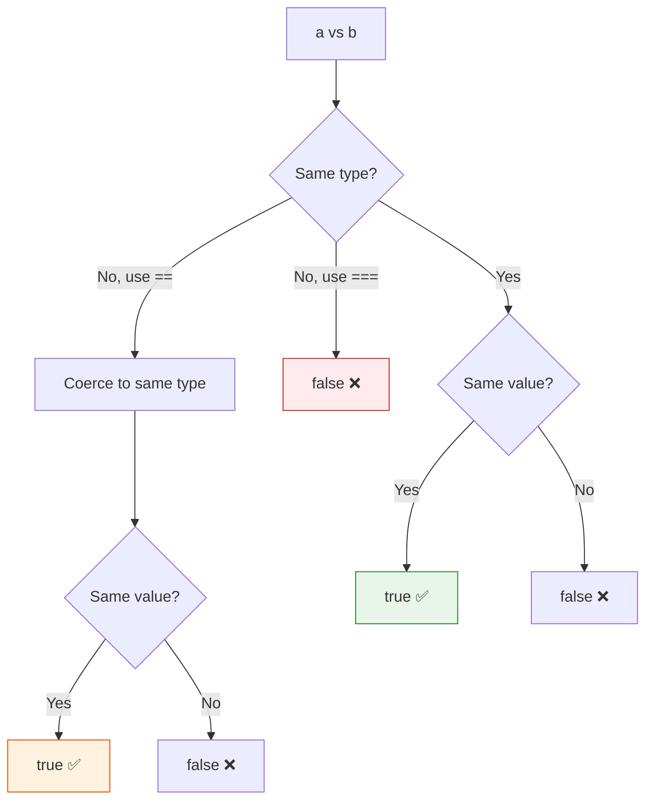

```js
// 36_Comparsion_Strict_loose.js
console.log(42 == "42");   // true   — string "42" coerced to number 42
console.log(42 === "42");  // false  — different types, strict rejects
console.log(42 == "45");   // false  — coerced, values still differ

console.log(true == 1);    // true   — true coerces to 1
console.log(false == 0);   // true   — false coerces to 0
console.log(true == "1");  // true   — both → 1

console.log(5 !== "5");    // true   — strict not-equal (type differs)
```

| Operator | Coerces? | Use when |
|:--------:|:--------:|:---------|
| `===` | ❌ | Default — always |
| `!==` | ❌ | Default — always |
| `==` | ✅ | Only `x == null` (matches null + undefined) |
| `!=` | ✅ | Only `x != null` |
| `>`, `<`, `>=`, `<=` | ✅ (no strict variant) | Numeric comparisons — guard for `null`/`NaN` first |

---

### 38 — Confusing Comparisons (the hall of fame)

**Concept:** Loose equality (`==`) walks a coercion algorithm that produces results no human would predict. `"" == 0` is `true`; `null >= 0` is `true` but `null == 0` is `false`; `NaN == NaN` is `false`; `[] == ![]` is `true`. These aren't bugs — they're spec, and they will eat your tests.

**Why:** Interviewers love these. Test runners hit them in filter conditions. Knowing the eight patterns below means you stop debugging and start fixing.

**Q&A — why use this?**
- **Q: Why is `null >= 0` true but `null == 0` false?** A: `>=` coerces `null` to `0` (relational rule). `==` has a special rule: `null` only equals `null` and `undefined`. Two different algorithms.
- **Q: How do I correctly check for `NaN`?** A: `Number.isNaN(x)` or `Object.is(x, NaN)`. **Never** `x === NaN` — it's always `false` because NaN equals nothing, not even itself.
- **Q: What's `[] == ![]` and why is it `true`?** A: `![]` → `false` → `0`. `[]` → `""` → `0`. `0 == 0` → `true`. The exclamation flips the empty array to false before coercion catches up.

```mermaid
flowchart LR
    NaN["NaN == NaN<br/>→ false"] --> Use[Use Number.isNaN&#40;x&#41;]
    Null["null == undefined<br/>→ true"] --> Pair[Only null/undefined pair like this]
    Empty["'' == 0<br/>'0' == 0<br/>'' == '0'  ← false"] --> Trans[Transitivity broken 🤯]
    Arr["[] == ![]<br/>→ true"] --> Trick[![] → false → 0;  [] → '' → 0]
    style NaN fill:#ffebee,stroke:#c62828
    style Empty fill:#fff3e0,stroke:#e65100
    style Arr fill:#fce4ec,stroke:#ad1457
```

```js
// 38_Confusing_Comparsion.js — the eight patterns
console.log("" == 0);             // true   — "" → 0
console.log("0" == 0);            // true   — "0" → 0
console.log("" == "0");           // false  — both strings, no coercion
console.log(null == undefined);   // true   — special rule
console.log(null == 0);           // false  — null only == undefined
console.log(null >= 0);           // true   — relational coerces null → 0
console.log(NaN === NaN);         // false  — NaN never equals anything
console.log(Number.isNaN(NaN));   // true   — correct check
console.log([] == false);         // true   — [] → "" → 0; false → 0
console.log([] == ![]);           // true   — !![] flips, both sides → 0
console.log(typeof null);         // "object" — 26-year legacy bug
```

**Takeaway:** Always reach for `===` / `!==`. Reserve `==` for one pattern only: `if (x == null)`. Use `Number.isNaN` for NaN, `Object.is` for `-0` vs `+0` edge cases.

---

### 39 — Logical & String Concatenation

**Concept:** Logical operators (`&&`, `||`, `!`) combine booleans. `&&` returns the first falsy or the last value; `||` returns the first truthy or the last value; `!` flips. `+` on a string concatenates — `"Hi" + " Dev"` → `"Hi Dev"` (use template literals for anything fancier).

**Why:** Conditional rendering of test data (`name || "Anonymous"`), guarding optional config (`opts && opts.headless`), and building dynamic log lines all live here.

**Q&A — why use this?**
- **Q: What does `user.name || "Guest"` actually return?** A: `user.name` if it's truthy (non-empty string, non-zero, etc.); otherwise the string `"Guest"`. Common default-value idiom.
- **Q: Why is `0 || "fallback"` not `0`?** A: `0` is falsy, so `||` skips it. If you want "use 0 if it's 0, fallback only if null/undefined", use `??` (nullish coalescing — coming in file 44).
- **Q: When should I drop `+` for strings?** A: Any time more than one variable is involved. Template literals (`` `Hi ${name}` ``) win on readability and avoid type-coercion surprises (`1 + "2"` → `"12"`).

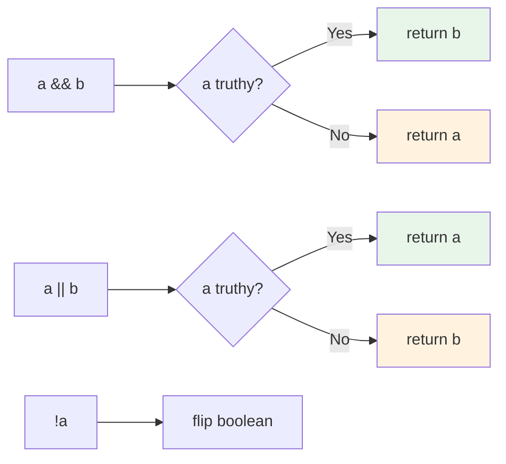

```js
// 39_Logical_Op.js + 40_String_Con_Op.js
let a = true;
let b = false;
console.log(a && b);   // false  — AND: both must be true
console.log(a || b);   // true   — OR: either is enough
console.log(!a);       // false  — NOT: flip

// short-circuit defaults
const userName = "" || "Guest";   // "Guest" — "" is falsy
const port     = 0  || 3000;      // 3000   — but use ?? if 0 is a valid value!

// string concatenation
let s = "Hi";
s += " Dev";
console.log(s);        // "Hi Dev"
```

---

### 41 — Ternary Operator `? :`

**Concept:** Ternary is a three-part expression — `condition ? whenTrue : whenFalse` — that **returns** a value. It's the only operator in JS that takes three operands and the cleanest way to assign one of two values based on a boolean.

**Why:** In test code, you reach for it constantly — pick the base URL by environment, pick `headless`/`headed` by CI flag, format pass/fail status, choose retry counts. Ternary keeps the decision and the assignment on one line.

**Q&A — why use this?**
- **Q: Ternary vs `if/else` — which when?** A: Use ternary when you're **returning or assigning** one of two values. Use `if/else` when you're running **side-effect statements** (logging multiple lines, mutating multiple vars). One value out → ternary. Multiple actions → `if/else`.
- **Q: Nested ternary — yes or no?** A: 2 levels max, formatted vertically (see `statusCode` example). Beyond that, switch to a lookup map or `if/else if`. Junior reviewers won't follow 4-deep nesting.
- **Q: Can I `await` inside a ternary?** A: Yes — `await (flag ? api.fast() : api.slow())`. The arms are expressions, so promises are fine.

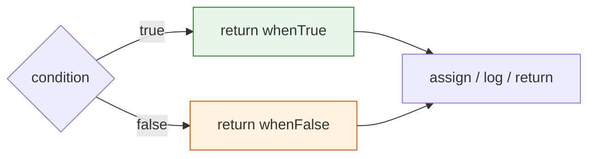

```js
// 41_Ternary_Op.js — real test-code patterns

// 1) Environment-driven base URL
const env = "staging";
const baseUrl = env === "prod"
    ? "https://api.example.com"
    : "https://staging-api.example.com";

// 2) CI-aware browser mode
const isCI = true;
const browserMode = isCI ? "headless" : "headed";

// 3) SLA check formatted inline
const responseTime = 850, sla = 1000;
const slaStatus = responseTime <= sla ? "Within SLA ✅" : "SLA breached ❌";

// 4) Nested ternary — HTTP status category (format vertically!)
const statusCode = 404;
const category =
    statusCode < 300 ? "Success" :
    statusCode < 400 ? "Redirect" :
    statusCode < 500 ? "Client Error" : "Server Error";
console.log(`Status ${statusCode}: ${category}`);   // Status 404: Client Error
```

| Use ternary when | Use `if/else` when |
|:--|:--|
| Returning / assigning a value | Running multiple statements |
| One simple condition | Multiple branches or side effects |
| Result fits on 1–2 lines | Body needs `{ … }` |

---

### 42 — `typeof` Operator

**Concept:** `typeof x` returns a **string** naming the type of `x` — `"string"`, `"number"`, `"boolean"`, `"undefined"`, `"object"`, `"function"`, `"bigint"`, `"symbol"`. It's a unary operator that never throws (even for undeclared identifiers).

**Why:** In assertions, fixtures, and guards you constantly need to ask "is this thing the type I expect?". `typeof` is the safe, fast answer for primitives — and the *only* way to test for `undefined` without a `ReferenceError` when the variable might not be declared.

**Q&A — why use this?**
- **Q: Why does `typeof []` return `"object"` and not `"array"`?** A: Arrays are objects under the hood. Use `Array.isArray(x)` to test for arrays — `typeof` can't tell array from plain object.
- **Q: Why does `typeof null` say `"object"`?** A: 26-year-old bug locked in for backwards compatibility. Test for null with `x === null`, never `typeof`.
- **Q: Is `typeof` safe on undeclared variables?** A: Yes — `typeof neverDeclared` → `"undefined"`. That makes it the *only* operator that doesn't throw a `ReferenceError` on a missing global. Useful for feature-detection (`typeof window !== "undefined"`).

```mermaid
mindmap
  root((typeof))
    "string"
      'pramod'
      "hi"
      `tpl`
    "number"
      42
      3.14
      NaN 🤯
    "boolean"
      true
      false
    "undefined"
      let x;
    "object"
      null 🐛
      []
      {}
    "function"
      ()=>{}
    "bigint"
      123n
```

```js
// 42_Type_Op.js
console.log(typeof "hello");   // "string"
console.log(typeof 123);       // "number"
console.log(typeof 31.4);      // "number"   ← no int/float split
console.log(typeof true);      // "boolean"
console.log(typeof undefined); // "undefined"
console.log(typeof null);      // "object"   ← classic JS bug
console.log(typeof []);        // "object"   ← arrays ARE objects
console.log(typeof {});        // "object"
console.log(typeof function() {}); // "function"
console.log(typeof 123n);      // "bigint"
```

| To detect | Don't use | Use |
|:--|:--|:--|
| `null` | `typeof x` | `x === null` |
| Array | `typeof x` | `Array.isArray(x)` |
| `NaN` | `typeof x === "number"` | `Number.isNaN(x)` |
| Undefined global | bare reference (throws) | `typeof x === "undefined"` |

---

### 43 — Increment / Decrement (`++` / `--`)

**Concept:** `++` adds 1, `--` subtracts 1. The position matters: **pre** (`++a`) increments **first**, then returns the new value. **Post** (`a++`) returns the **old** value, then increments. Same logic for `--`.

**Why:** Loop counters, retry counts, version bumps, and a beloved class of interview puzzles. Mixing pre/post in one expression is the #1 way junior devs get the wrong number.

**Q&A — why use this?**
- **Q: When does pre vs post actually matter?** A: Only when the value is **used in the same expression**. Standalone `i++;` and `++i;` behave identically. Inside `let b = a++` vs `let b = ++a` — the value of `b` differs.
- **Q: Is `++` allowed on `const`?** A: No — `++`/`--` reassign the binding (`x = x + 1`), so `const` throws `TypeError: Assignment to constant variable`.
- **Q: Should I use `++` in tests or stick to `+= 1`?** A: Either works. `+= 1` reads slightly more explicit and avoids the pre/post mistake entirely. Many style guides ban `++` for this reason.

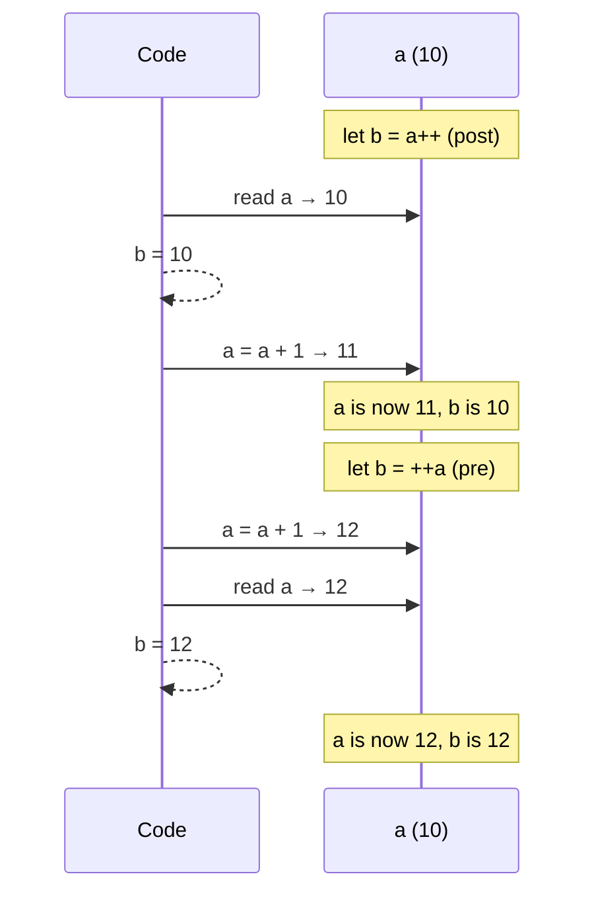

```js
// 43_Incre_Decre_Op.js  +  45_Post_Increment.js  +  46_IQ_INCREMENT_D.js

// Post-decrement: return OLD, then decrement
let a = 10;
let b = a--;
console.log(b);   // 10  ← old value
console.log(a);   //  9  ← decremented after

// Post-increment: return OLD, then increment
let a_post = 10;
let p = a_post++;
console.log(a_post); // 11
console.log(p);      // 10

// Interview: what does this log?
let x = 34;
let result = x++;
console.log(result); // 34   ← post returns old
console.log(x);      // 35
```

| Form | Returns | Then |
|:----:|:--------|:-----|
| `++a` | new value (a+1) | a is incremented |
| `a++` | old value (a) | a is incremented |
| `--a` | new value (a-1) | a is decremented |
| `a--` | old value (a) | a is decremented |

---

### 44 — Nullish Coalescing `??`

**Concept:** `a ?? b` returns `a` **unless** `a` is `null` or `undefined`, in which case it returns `b`. Unlike `||`, it does **not** fall through on other falsy values like `0`, `""`, or `false`.

**Why:** When `0` or `""` is a **valid** value (port number, search query, page index) but you still want to default `null`/`undefined`, `||` gives the wrong answer. `??` is the precise fix that ships in every modern config and options object.

**Q&A — why use this?**
- **Q: `??` vs `||` — when to switch?** A: Use `??` when `0`/`""`/`false` are valid values you want to keep. Use `||` when *any* falsy means "fall back" (typical for object/string defaults).
- **Q: Can I combine `??` with `&&` or `||`?** A: Only with parentheses — `a ?? b || c` is a SyntaxError. Write `(a ?? b) || c` explicitly. JS forces the parens so the precedence is unambiguous.
- **Q: Does `??` work on `NaN`?** A: No — `NaN` is **not** nullish. `NaN ?? "fallback"` returns `NaN`. Only `null` and `undefined` trigger the fallback.

```mermaid
flowchart LR
    A["a ?? b"] --> Q{a is null<br/>or undefined?}
    Q -->|Yes| RB[return b]
    Q -->|No| RA[return a]
    RA --> Note0[0, '', false → kept ✅]
    style RA fill:#e8f5e9,stroke:#2e7d32
    style RB fill:#fff3e0,stroke:#e65100
```

```js
// 44_Null_Op.js
const amul = null;
const milk = amul ?? "nandani milk";
console.log(milk);            // "nandani milk"

// The classic || vs ?? trap
const port_or = 0 || 3000;    // 3000  ← || treats 0 as falsy (wrong if 0 valid)
const port_nc = 0 ?? 3000;    //    0  ← ?? keeps 0 ✅

const query_or = "" || "default"; // "default" ← may not be what you want
const query_nc = "" ?? "default"; //        "" ← keeps empty string ✅
```

| Value | `value \|\| "fallback"` | `value ?? "fallback"` |
|:-----:|:-----------------------:|:----------------------:|
| `null` | `"fallback"` | `"fallback"` |
| `undefined` | `"fallback"` | `"fallback"` |
| `0` | `"fallback"` ❌ | `0` ✅ |
| `""` | `"fallback"` ❌ | `""` ✅ |
| `false` | `"fallback"` ❌ | `false` ✅ |
| `NaN` | `"fallback"` | `NaN` |

---

### 47 — Pre/Post Mixed in One Expression (🔥 IQ Trap)

**Concept:** When `++a` and/or `a++` appear **inside the same expression**, each sub-expression evaluates left-to-right: each `++a` mutates `a` and reads the **new** value; each `a++` reads the **old** value and mutates `a`. Track `a` step by step.

**Why:** Pure interview-trap territory — and shows up in real bugs when someone "cleverly" combines a counter increment with a use of the counter. The cure is to never write expressions like this in production. The skill is reading them when other people did.

**Q&A — why use this?**
- **Q: `let a = 10; console.log(++a + ++a)` — what's logged?** A: `23`. Step 1: `++a` → `a = 11`, returns `11`. Step 2: `++a` → `a = 12`, returns `12`. Sum: `11 + 12 = 23`.
- **Q: `let a = 10; console.log(a++ + ++a)` — what's logged?** A: `22`. Step 1: `a++` returns `10`, then `a = 11`. Step 2: `++a` → `a = 12`, returns `12`. Sum: `10 + 12 = 22`.
- **Q: Should I ever write code like this?** A: No. If a reviewer needs a whiteboard to follow your expression, rewrite as separate `a += 1` lines.

```mermaid
sequenceDiagram
    participant E as Expression
    participant a as a (10)
    Note over E,a: ++a + ++a
    E->>a: ++a → a = 11
    a-->>E: 11
    E->>a: ++a → a = 12
    a-->>E: 12
    E-->>E: 11 + 12 = 23
    Note over a: final a = 12
```

```js
// 47_Advance_ID_.js — the three IQ classics
// Track a step by step. Don't guess.

let a = 10;
console.log(++a + ++a);  // 23   (a → 11, then 12; 11+12)
console.log(a);          // 12

let b = 10;
console.log(b++ + ++b);  // 22   (b++ → 10 with b→11; ++b → 12; 10+12)
console.log(b);          // 12

let c = 10;
console.log(++c + c);    // 22   (++c → 11 then read c → 11; 11+11)
console.log(c);          // 11
```

**Takeaway:** When you see mixed `++`/`--` in an expression, replace each occurrence in your head with its pre/post rule, mutate the variable as you go, and **never write this code yourself** — use `a += 1` lines and reference `a` afterwards.

---

## 📖 What's in Chapter 7 — If / Else (Available Now)

### Files

| File | Topic | What you'll learn |
|------|-------|-------------------|
| `48_IF_ESLE.js` | Basic if/else | Vote eligibility with `age > 18` |
| `49_If_elseif_else.js` | Else-if ladder | Grade scoring (A → F) |
| `50_REAL_IF_ELSE.js` | Nested if/else | Login check → role-based access (admin / editor / viewer) |
| `51_API_IF_ELSE.js` | API branching | Status-code-driven console messages |
| `52_IQ_IF_ELSE.js` | Truthy vs falsy | Which values count as `true` / `false` in an `if` |
| `53_IF_ELSE_real.js` | Logical + if/else | Combine `&&` / `\|\|` with nested conditions (auth logic) |
| `54_IQ.js` | One-line if | `if` without braces — when it works |
| `55_IE.js` | Empty if | A bare `if (true) { }` block |
| `56_IQ_EVEN_ODD.js` | Even / odd | `% 2 === 0` check |
| `57_Grade_Calc.js` | Grade calculator | Clean else-if ladder for marks → A–F |
| `58_LEAP_YEAR.js` | Leap year | `% 4 && !% 100 \|\| % 400` rule |

### Key Concepts

```mermaid
mindmap
  root((Chapter 7 — If / Else))
    Basic
      if
      else
    Ladder
      if ... else if ... else
    Nested
      if inside if
    Truthy
      non-zero numbers
      non-empty strings
      objects / arrays
    Falsy
      0
      ""
      null
      undefined
      NaN
    Logical combo
      &&  both true
      ||  either true
```

### Run them

```bash
node "02-control-flow/01-conditionals/48-ifelse.js"          # → "You are allowed to vote!"
node "02-control-flow/01-conditionals/49-if-elseif-else.js"  # → grade for score = 78
node "02-control-flow/01-conditionals/50-real-ex-ifelse.js"  # → role-based welcome message
node "02-control-flow/01-conditionals/51-api-ex-if-ifelse-else.js" # → API status messages
node "02-control-flow/01-conditionals/52-iq-ex-ifelse.js"    # → truthy / falsy surprise
node "02-control-flow/01-conditionals/53-if-elseif-real.js"  # → "Allowed to enter"
node "02-control-flow/01-conditionals/56-even-odd.js"        # → "7 is Odd"
node "02-control-flow/01-conditionals/57-grade.js"           # → "Grade: B"
node "02-control-flow/01-conditionals/58-leapyear.js"        # → "2024 is a Leap Year"
```

---

### 48 — Basic If / Else

**Concept:** An `if` statement evaluates a condition. If the condition is *truthy*, the first block runs; otherwise the `else` block runs. It's the simplest form of control flow.

**Why:** Every program needs decisions — "is the user logged in?", "is the API 200?", "is the price > budget?". If/else is the first tool for that.

```js
// 48_IF_ESLE.js
let age = 20;
if (age > 18) {
    console.log("You are allowed to vote!");
} else {
    console.log("You are not allowed to vote!");
}
```

---

### 52 — Truthy vs Falsy

**Concept:** In a boolean context (`if`, `while`, `&&`, `||`), JS coerces values to `true` or `false`. "Falsy" values are `0`, `""`, `null`, `undefined`, `NaN`, and `false`. Everything else is "truthy".

**Why:** Debugging "why didn't my if-block run?" usually comes down to a falsy value you didn't expect — especially `0` or `""`.

```js
// 52_IQ_IF_ELSE.js
if ("hello") console.log("String is truthy");   // prints
if (42)      console.log("Number is truthy");   // prints
if ({})      console.log("Empty object is truthy!"); // prints
if ([])      console.log("Empty array is truthy!");  // prints

if ("")      console.log("Won't print");          // "" is falsy
if (0)       console.log("Won't print");          // 0 is falsy
if (null)   console.log("Won't print");          // null is falsy
```

| Value | Truthy? |
|-------|:-------:|
| `"hello"` | ✅ |
| `42` | ✅ |
| `-1` | ✅ |
| `0` | ❌ |
| `""` | ❌ |
| `" "` | ✅ |
| `null` | ❌ |
| `undefined` | ❌ |
| `NaN` | ❌ |
| `{}` | ✅ |
| `[]` | ✅ |

---

### 58 — Leap Year

**Concept:** A year is a leap year if it is divisible by 4 **and not** divisible by 100, **or** it is divisible by 400.

**Why:** Classic interview question that tests understanding of compound boolean logic and operator precedence.

```js
// 58_LEAP_YEAR.js
let year = 2024;
if ((year % 4 === 0 && year % 100 !== 0) || year % 400 === 0) {
    console.log(year + " is a Leap Year");
} else {
    console.log(year + " is NOT a Leap Year");
}
```

---

## 📖 What's in Chapter 8 — Switch Statement (Available Now)

> 📁 **Location:** `02-control-flow/01-conditionals/`

### Files

| File | Topic | What you'll learn |
|------|-------|-------------------|
| `59_Switch.js` | Switch basics | `switch (expr)` with `case` and `default` |
| `60_No_Break.js` | Fall-through | What happens when you forget `break` |
| `61_Default.js` | `default` | The catch-all branch |
| `62_REAL_TIME_EXAMPLE.js` | Real-world | Status / role / env routing with `switch` |
| `63_Switch_Group.js` | Grouped cases | Multiple `case` labels sharing one body |
| `64_IQ.js` | Interview Q | Switch trap #1 |
| `65_IQ2.js` | Interview Q | Switch trap #2 |
| `66_IQ3.js` | Interview Q | Switch trap #3 |
| `67_IQ4.js` | Interview Q | Switch trap #4 |

### Key Concepts

```mermaid
mindmap
  root((Chapter 8 — Switch))
    switch
      expression
      strict ===
    case
      value match
      break to exit
      grouped cases
    default
      fallback
    fall-through
      missing break
```

---

## 📖 What's in Chapter 9 — User Input (Available Now)

> 📁 **Location:** `02-control-flow/02-user-input/`

### Files

| File | Topic | What you'll learn |
|------|-------|-------------------|
| `68_User_Input.js` | `prompt()` (browser) | Browser-only API — fails in Node with `ReferenceError` |
| `69_Node_readline.js` | Node `readline` | Built-in module, async `rl.question()` for terminal input |
| `70_prompt_sync.js` | `prompt-sync` | npm package for synchronous terminal input |

### Key Concepts

```mermaid
mindmap
  root((Chapter 9 — User Input))
    Browser
      prompt&#40;&#41;
      not in Node
    Node built-in
      readline
      async callback
      rl.close&#40;&#41;
    npm package
      prompt-sync
      synchronous
      one-liner
    Always
      input is string
      Number&#40;input&#41; to parse
```

| Approach | Where it runs | Style | Needs install |
|----------|---------------|-------|:--:|
| `prompt()` | Browser only | Sync | ❌ (built-in to browser) |
| `readline` | Node | Async (callback) | ❌ (built-in to Node) |
| `prompt-sync` | Node | Sync | ✅ (`npm i prompt-sync`) |

---

## 📖 What's in Chapter 10 — Loops (Available Now)

> 📁 **Location:** `02-control-flow/03-loops/`

### Files

| File | Topic | What you'll learn |
|------|-------|-------------------|
| `71_For_loop.js` | For loop intro | Why loops exist — replacing repeated `console.log` lines |
| `72_For_loop.js` | For with `<=` | `i = 0; i <= 5` runs 6 times (0 through 5) |
| `73_For_Loop2.js` | Loop boundaries | `i <= 10` vs `i < 10` — 11 vs 10 iterations |
| `74_IQ.js` | Loop + if/else | Combine loops with conditional branching |
| `75_For_OF_IN_EACH.js` | while retry | while loop as a retry mechanism |
| `76_While.js` | while loop | Three parts: init, condition, update |
| `77_Do_While.js` | do-while | Guaranteed one execution regardless of condition |
| `78_Do_While.js` | do-while retry | Retry with do-while (always runs at least once) |
| `79_IQ.js` | while countdown | Decrementing loop — `i--` instead of `i++` |
| `80_IQ.js` | do-while trap | Do-while off-by-one: runs once even when condition is false |
| `81_IQ.js` | continue in for | `continue` skips current iteration, next one runs |
| `82_IQ.js` | do-while infinite | do-while with always-true condition |

### Key Concepts

```mermaid
mindmap
  root((Chapter 10 — Loops))
    for
      init; condition; update
      i++ increment
      i-- decrement
    while
      checks condition first
      might never run
    do-while
      runs at least once
      checks after body
    break
      exits loop early
    continue
      skips current iteration
```

### Run them

```bash
node "02-control-flow/03-loops/71-for-loop.js"                  # → 1 to 10 + introduction
node "02-control-flow/03-loops/72-for-loop.js"                  # → 0, 1, 2, 3, 4, 5
node "02-control-flow/03-loops/73-for-loop-1.js"                # → 0 to 10 (11 iterations)
node "02-control-flow/03-loops/74-loops-iq.js"                  # → for + if/else
node "02-control-flow/03-loops/75-for-in-of-each-loops.js"      # → while retry
node "02-control-flow/03-loops/76-while-loop.js"                # → while countdown
node "02-control-flow/03-loops/77-do-while.js"                  # → do-while guaranteed run
node "02-control-flow/03-loops/78-do-while.js"                  # → do-while retry
node "02-control-flow/03-loops/79-iq.js"                        # → 5, 4, 3, 2, 1
node "02-control-flow/03-loops/80-iq.js"                        # → 0 (do-while off-by-one)
node "02-control-flow/03-loops/81-iq.js"                        # → 0, 2 (continue skips 1)
node "02-control-flow/03-loops/82-iq.js"                        # → 1 only (infinite if not careful)
```

### 71 — For Loop

**Concept:** A `for` loop replaces manually repeating `console.log` calls. It has three parts: **initialization** (`let i = 0`), **condition** (`i < N`), and **update** (`i++`). The body runs while the condition is true.

**Why:** Anywhere you need to iterate a known number of times — processing test data rows, retrying a flaky API, generating N test values.

```js
// 71_For_loop.js — the "why loops" file
console.log(1);
console.log(2);
console.log(3);
// ... imagine 100 lines ...
console.log(10);

// For Loop — helps you repeat a block of code
```

```js
// 72_For_loop.js — basic for with <=
for (let i = 0; i <= 5; i++) {
    console.log(i);  // 0, 1, 2, 3, 4, 5
}
```

| File | `for` loop | Iterations | Output |
|:--|:--|:--:|:--|
| `72_For_loop.js` | `i = 0; i <= 5; i++` | 6 | 0, 1, 2, 3, 4, 5 |
| `73_For_Loop2.js` | `i = 0; i <= 10; i++` | 11 | 0 to 10 |
| `74_IQ.js` | `i = 0; i < 18; i++` + if/else | 18 | conditional gift logic |

**Key pattern — three parts of a for loop:**

```mermaid
flowchart LR
    I["init<br/>let i = 0"] --> C{"condition<br/>i < 5 ?"}
    C -->|true| B[run body]
    B --> U["update<br/>i++"]
    U --> C
    C -->|false| D[Done ✅]
    style I fill:#e3f2fd,stroke:#01579b
    style C fill:#fff3e0,stroke:#e65100
    style U fill:#f3e5f5,stroke:#7b1fa2
```

### 76 — While Loop

**Concept:** `while (condition) { … }` checks the condition **before** each iteration. If the condition is already false, the body **never runs**. Three essential parts: init (`let i = 0`), condition (`i < 5`), update (`i++`).

**Why:** Use when you don't know how many iterations you need — retrying an API until it succeeds, reading lines until EOF, polling until a condition is met.

```js
// 76_While.js — the three-part pattern
let attempt = 0;          // init
while (attempt < 3) {     // condition
    console.log(attempt);
    attempt++;            // update
}

let modi = 1;
while (modi <= 15) {
    console.log("Modi will do 15+ years");
    modi++;
}
```

### 77 — Do-While Loop

**Concept:** `do { … } while (condition)` runs the body **at least once** — the condition is checked *after* the body. Guaranteed one execution regardless of the condition.

**Why:** "Try once, then check if you need to retry" — perfect for login prompts, data fetch + retry, or any action that must happen at least once.

```js
// 77_Do_While.js — runs once even when a >= 10
let a = 10;
do {
    console.log(a);   // prints 10
    a++;
} while (a < 10);     // condition already false, but body ran

// 78_Do_While.js — retry pattern
let retry = 0;
do {
    console.log("Execute a code!");
    console.log("Retrying.....", retry);
    retry++;
} while (retry < 3);
```

| Loop type | Condition check | Minimum runs | When to use |
|:--|:--|:--:|:--|
| `for` | Before each iteration | 0 | Known iteration count |
| `while` | Before each iteration | 0 | Unknown count, maybe zero |
| `do-while` | After each iteration | **1** | Must run at least once |

### 79–80 — IQ: Countdown & Off-by-One

**Concept:** `i--` decrements the counter — same loop, different direction. Do-while off-by-one: when the condition starts false, it still executes once (the body prints, then the condition fails).

```js
// 79_IQ.js — countdown
let i = 5;
while (i > 0) {
    console.log(i);   // 5, 4, 3, 2, 1
    i--;
}

// 80_IQ.js — do-while off-by-one trap
let i = 0;
do {
    console.log(i);   // prints 0 (once), then condition fails
    i--;
} while (i > 0);      // i is -1, condition is false → loop ends
```

### 81 — Continue

**Concept:** `continue` skips the **rest of the current iteration** and jumps to the next one. Unlike `break`, it doesn't exit the loop — it only skips.

```js
// 81_IQ.js
for (let i = 0; i < 3; i++) {
    if (i === 1) continue;    // skip the rest when i is 1
    console.log(i);           // 0, 2
}
```

### 82 — Do-While Always-True Trap

**Concept:** A do-while loop where the condition is always true will run **forever** (infinite loop) unless you `break` or it's intentionally bounded.

```js
// 82_IQ.js — pattern: runs at least once
let n = 1;
do {
    console.log(n);   // prints 1
} while (n < 3);      // 1 < 3 → true → runs again... wait, there's no update!
```

**Takeaway:** Always include an update (`n++`) or a `break` inside a loop body. No update = infinite loop = frozen program.

---

## 📖 What's in Chapter 11 — Arrays (Available Now)

> 📁 **Location:** `03-data-structures/01-arrays/`

### Files

| File | Topic | What you'll learn |
|------|-------|-------------------|
| `83_Arrays.js` | Arrays basics | Literal `[]`, index access, `length`, mixed types, `undefined` out-of-bounds |
| `84_Arrays.js` | Array creation | Array literal, `new Array()`, `Array.of()`, `Array.from()` |
| `85_Access_Array.js` | Access & modify | Bracket notation `[]`, `.at()` with negative index, modifying in place |
| `86_Arrays_Adding_Remove.js` | Add/remove | `push`, `pop`, `unshift`, `shift` |
| `87_Adding_Remove2.js` | Splice | `splice(start, deleteCount, ...items)` — add, remove, replace at any position |
| `88_REAL_Example.js` | Real-world | Browser list manipulation — iterate, search, remove |
| `89_Searching.js` | Searching | `indexOf`, `lastIndexOf`, `includes`, `find`, `findIndex`, `findLast`, `findLastIndex` |
| `90_Iterate.js` | Iteration | `for`, `for...of`, `forEach`, `for...in`, `.entries()` |
| `91_Transform_Array.js` | Transform | `map`, `filter`, `reduce`, `flat` |
| `92_Arrays.js` | Sorting | `sort()` default is lexicographic; pass `(a,b)=>a-b` for numeric |
| `93_Array_Slicing.js` | `slice` vs `splice` | `slice` returns a copy (safe); `splice` mutates in place (surgery) |
| `94_Concat_array.js` | Combine | `concat`, spread `...`, `join("|")` |
| `95_Array_Checking.js` | Predicates | `Array.isArray`, `every` (ALL pass), `some` (AT LEAST ONE passes) |

### Key Concepts

```mermaid
mindmap
  root((Chapter 11 — Arrays))
    Creation
      literal []
      new Array()
      Array.of()
      Array.from()
    Access
      bracket [0]
      .at(-1)
      modify
    Add/Remove
      push (end)
      pop (end)
      unshift (start)
      shift (start)
      splice (any)
    Search
      indexOf
      lastIndexOf
      includes
      find
      findIndex
    Iterate
      for loop
      for...of
      forEach
      for...in
      .entries()
    Transform
      map
      filter
      reduce
      flat
    Sort
      default lexicographic
      (a,b)=>a-b numeric
    Slice vs Splice
      slice = copy
      splice = mutate
    Combine
      concat
      spread ...
      join
    Check
      Array.isArray
      every
      some
```

### Run them

```bash
node "03-data-structures/01-arrays/83-array.js"                    # → array basics, index, mixed types
node "03-data-structures/01-arrays/84-array.js"                    # → Array constructor, Array.of, Array.from
node "03-data-structures/01-arrays/85-array.js"                    # → access, .at(-1), modify
node "03-data-structures/01-arrays/86-array-adding-removing.js"    # → push, pop, unshift, shift
node "03-data-structures/01-arrays/87-arrays-adding-removing-2.js" # → splice add/remove/replace
node "03-data-structures/01-arrays/88-real-example.js"             # → real browser list example
node "03-data-structures/01-arrays/90-iterate.js"                  # → 5 ways to iterate arrays
node "03-data-structures/01-arrays/91-transform-array.js"          # → map, filter, reduce, flat
node "03-data-structures/01-arrays/92-array.js"                    # → sort default (lexicographic) + numeric/desc
node "03-data-structures/01-arrays/93-array-slicing.js"            # → slice vs splice
node "03-data-structures/01-arrays/94-concat.js"                   # → concat, spread, join
node "03-data-structures/01-arrays/95-arrays-checking.js"          # → Array.isArray, every, some
```

### 83 — Arrays Basics

**Concept:** Arrays are ordered collections of values. Use literal syntax `[]` (preferred). Index starts at `0`. `length` gives count. Out-of-bounds access returns `undefined`. Arrays can hold mixed types.

**Why:** Test data comes in lists — test names, element handles, results, URLs. Arrays are the first data structure every SDET needs.

```js
// 83_Arrays.js
let fruits = [];                         // empty array
let fruits_fresh = ["apple", "banana", "cherry"];  // length = 3, index 0-2

let arr = [10, 20, 30, 40];
console.log(arr[0]);   // 10
console.log(arr[3]);   // 40
console.log(arr[4]);   // undefined (out of bounds)

let testResults = ["pass", "fail", "pass", "skip"];
let mixed = [1, "hello", true, null];    // JS arrays can hold any type
```

### 84 — Array Creation Methods

**Concept:** Beyond the literal `[]`, you can create arrays with `new Array(n)` (pre-allocates `n` empty slots), `Array.of(...items)` (safe constructor), and `Array.from(iterable)` (converts strings/iterables to arrays).

**Why:** `Array.from("hello")` → `["h","e","l","l","o"]` is perfect for splitting strings. `new Array()` with a single number argument creates sparse arrays — a common trap. Use `Array.of()` when you want predictable behavior.

```js
// 84_Arrays.js
let browsers = ["Chrome", "Firefox", "Safari"];        // literal (preferred)
let scores = new Array(3);                             // [empty × 3]
let scores2 = new Array(1, 2, 3);                      // [1, 2, 3]
let numbers = new Array(100, 200, 300, 400);           // [100, 200, 300, 400]
let test = Array.of(10, 20, 30, 40, 50);               // [10, 20, 30, 40, 50]
let chars = Array.from("hello");                       // ["h", "e", "l", "l", "o"]
```

| Method | Use when | Trap |
|:--|:--|:--|
| `[]` | **Always** (default) | None |
| `new Array(n)` | Pre-allocate known size | `new Array(3)` = sparse, not `[3]` |
| `Array.of(...)` | Safe constructor | No trap — always works as expected |
| `Array.from(iterable)` | Convert string/iterable | Only works on iterable objects |

### 85 — Access & Modify (with `.at()`)

**Concept:** Use bracket notation `[index]` for access and assignment. `.at(index)` is the modern alternative that supports **negative indices** (`.at(-1)` = last element).

**Why:** Negative indexing saves `arr[arr.length - 1]` boilerplate. In test code, `.at(-1)` cleanly grabs the last result, last error, last screenshot — without calculating length.

```js
// 85_Access_Array.js
let statuses = ["pass", "fail", "skip"];
console.log(statuses[0]);       // "pass"
console.log(statuses.at(-1));   // "skip" (last element)
console.log(statuses.at(-2));   // "fail"

statuses[1] = "blocked";        // modify in place
console.log(statuses);          // ["pass", "blocked", "skip"]
```

### 86 — Add & Remove (Queue/Stack Operations)

**Concept:** Four methods that work on the ends of arrays:
- `push(x)` — add to **end** (stack push)
- `pop()` — remove from **end** (stack pop)
- `unshift(x)` — add to **start** (queue enqueue)
- `shift()` — remove from **start** (queue dequeue)

**Why:** Test queues (next test to run), result stacks (latest result first), retry lists — these four operations cover 90% of array mutations in automation.

```js
// 86_Arrays_Adding_Remove.js
let arr = [1, 2, 3];
arr.push(4);        // [1, 2, 3, 4]
arr.pop();          // [1, 2, 3]
arr.push(5, 6);     // [1, 2, 3, 5, 6]
arr.unshift(0);     // [0, 1, 2, 3, 5, 6]
arr.shift();        // [1, 2, 3, 5, 6]
```

### 87 — Splice (Add, Remove, Replace at Any Position)

**Concept:** `arr.splice(start, deleteCount, ...itemsToAdd)` — the Swiss Army knife. Insert at `start` (deleteCount=0), remove at `start` (deleteCount=N), or replace (deleteCount=M + itemsToAdd).

**Why:** When you need to surgically modify test data — remove a flaky test from a suite, inject a fixture at a specific position, replace expected values mid-run.

```js
// 87_Adding_Remove2.js
let arr = [1, 2, 3, 4, 5, 6];
arr.splice(1, 2, 10, 20);   // delete 2 items at index 1, insert 10, 20
console.log(arr);           // [1, 10, 20, 4, 5, 6]
```

| Splice call | Effect | Result |
|:--|:--|:--|
| `splice(2, 0, 99)` | Insert `99` at index 2 | `[1, 2, 99, 3, 4, 5, 6]` |
| `splice(2, 1)` | Remove 1 item at index 2 | `[1, 2, 4, 5, 6]` |
| `splice(2, 1, 99)` | Replace item at index 2 | `[1, 2, 99, 4, 5, 6]` |

### 89 — Searching Arrays

**Concept:** Six search methods — `indexOf`/`lastIndexOf` (exact match, return index or `-1`), `includes` (boolean), `find`/`findIndex` (first match by predicate), `findLast`/`findLastIndex` (search from end).

**Why:** Finding a specific test result, locating an element in a list, checking if a browser is supported — searching is the most common array operation in test code.

```js
// 89_Searching.js
let results = ["pass", "fail", "pass", "error", "fail"];
results.indexOf("fail");            // 1 (first occurrence)
results.lastIndexOf("fail");        // 4 (search from end)
results.includes("error");          // true
results.includes("skip");           // false

let nums = [10, 25, 30, 45];
nums.find(n => n > 20);             // 25 (first matching value)
nums.findIndex(n => n > 20);        // 1 (index of first match)
nums.findLast(n => n > 20);         // 45 (last matching value)
nums.findLastIndex(n => n > 20);    // 3 (index of last match)
```

### 90 — Five Ways to Iterate

**Concept:** JavaScript offers five iteration patterns — classic `for` (full control), `for...of` (cleanest for values), `forEach` (callback style, has index), `for...in` (iterates indices as strings), `.entries()` (index + value pairs with destructuring).

**Why:** Different patterns for different jobs: `for...of` for simple reads, `forEach` for side effects with index, `for` when you need to `break`/`continue`, `.entries()` when you need both index and value cleanly.

```js
// 90_Iterate.js
let tests = ["login", "checkout", "search"];

// 1) Classic for — full control, can break/continue
for (let i = 0; i < tests.length; i++) {
    console.log(tests[i]);
}

// 2) for...of — cleanest for values only
for (let test of tests) {
    console.log(test);
}

// 3) forEach — callback, has index, cannot break
tests.forEach((item, index) => {
    console.log(item, index);
});

// 4) for...in — iterates indices (as strings!)
for (let i in tests) {
    console.log(i, tests[i]);
}

// 5) .entries() — index + value pairs (preferred for indexed iteration)
for (let [i, test] of tests.entries()) {
    console.log(i, test);
}
```

| Method | Break/Continue | Index | Best for |
|:--|:--:|:--:|:--|
| `for` loop | ✅ | ✅ | When you need to exit early |
| `for...of` | ✅ | ❌ | Simple value iteration |
| `forEach` | ❌ | ✅ | Functional style, side effects |
| `for...in` | ✅ | ✅ (as strings) | Objects, not recommended for arrays |
| `.entries()` | ✅ | ✅ | When you need both index and value |

### 91 — Transform (map, filter, reduce, flat)

**Concept:** Higher-order array methods that return **new arrays** (no mutation):
- `map(fn)` — transform each element (same length output)
- `filter(fn)` — keep elements that pass a test (shorter or same length)
- `reduce(fn, initial)` — accumulate to a single value
- `flat()` — flatten nested arrays by one level (or `flat(depth)` for more)

**Why:** These are the workhorses of test data processing — transforming raw API responses into clean test data, filtering for specific conditions, aggregating results into summaries.

```js
// 91_Transform_Array.js
let scores = [45, 82, 91, 60, 73];

// map — transform every element
let grades = scores.map(s => s > 70 ? "Pass" : "Fail");
console.log(grades);   // ["Fail", "Pass", "Pass", "Fail", "Pass"]

// filter — keep passing elements
let passing = scores.filter(s => s > 70);
console.log(passing);  // [82, 91, 73]

// reduce — accumulate to single value
let total = scores.reduce((a, b) => a + b, 0);
console.log(total);    // 351

// flat — flatten nested arrays
let nested = [[1, 2], [3, 4], [5]];
console.log(nested.flat());  // [1, 2, 3, 4, 5]
```

| Method | Returns | Length | Mutation |
|:--|:--|:--|:--|
| `map(fn)` | New array | Same as original | ❌ |
| `filter(fn)` | New array | ≤ original | ❌ |
| `reduce(fn, init)` | Single value | N/A | ❌ |
| `flat(depth)` | New array | Depends | ❌ |

**Chaining example** — the pattern you'll use most in test code:

```js
let results = [
    { name: "Login", status: "pass", time: 1.2 },
    { name: "Checkout", status: "fail", time: 3.4 },
    { name: "Search", status: "pass", time: 0.8 },
];

let passed = results
    .filter(r => r.status === "pass")    // keep only passing
    .map(r => r.name)                     // extract names
    .sort();                              // sort alphabetically

console.log(passed);  // ["Login", "Search"]
```

### 92 — Sorting (the lexicographic trap)

**Concept:** `arr.sort()` with **no compare function** converts every element to a string and sorts by UTF-16 code units. That's why `[10, 1, 21, 2].sort()` returns `[1, 10, 2, 21]` — `"10"` comes before `"2"` because `'1' < '2'` character-wise. Pass a compare function `(a, b) => a - b` for true numeric ascending; `(a, b) => b - a` for descending.

**Why:** Sorting numeric test data, scores, response times, or status codes by default `sort()` silently produces wrong order. This is one of the most common bugs in beginner test code — and a frequent interview question.

**Q&A — why use this?**
- **Q: Why is `[10, 1, 21, 2].sort()` → `[1, 10, 2, 21]`?** A: Default sort compares values as strings. `"10"` < `"2"` because `'1'` (49) < `'2'` (50) in UTF-16. Always pass a compare function for numbers.
- **Q: What does the compare function return?** A: `< 0` → `a` comes first; `> 0` → `b` comes first; `0` → keep order. `a - b` is ascending, `b - a` is descending.
- **Q: Does `sort()` mutate the original array?** A: Yes — it sorts in place **and** returns the same reference. Use `[...arr].sort(...)` if you need to preserve the original.

```mermaid
flowchart LR
    A["[10, 1, 21, 2].sort()"] --> B[coerce → strings]
    B --> C{compare UTF-16}
    C --> D["[1, 10, 2, 21] ❌"]
    A2["[10, 1, 21, 2].sort((a,b)=>a-b)"] --> C2[numeric compare]
    C2 --> D2["[1, 2, 10, 21] ✅"]
    style D fill:#ffebee,stroke:#c62828
    style D2 fill:#e8f5e9,stroke:#2e7d32
```

```js
// 92_Arrays.js
let nums = [10, 1, 21, 2];
nums.sort();                       // [1, 10, 2, 21]   ← lexicographic
nums.sort((a, b) => a - b);        // [1, 2, 10, 21]   ← numeric ascending
nums.sort((a, b) => b - a);        // [21, 10, 2, 1]   ← numeric descending

let fruits = ["banana", "apple", "cherry"];
fruits.sort();                     // ["apple", "banana", "cherry"]  ← strings sort correctly by default
```

| Call | Returns | Why |
|:--|:--|:--|
| `[10, 1, 21, 2].sort()` | `[1, 10, 2, 21]` | Lexicographic (string compare) |
| `[10, 1, 21, 2].sort((a,b)=>a-b)` | `[1, 2, 10, 21]` | Numeric ascending |
| `[10, 1, 21, 2].sort((a,b)=>b-a)` | `[21, 10, 2, 1]` | Numeric descending |
| `["b", "a", "c"].sort()` | `["a", "b", "c"]` | Strings → lexicographic is correct |

---

### 93 — `slice` vs `splice` (copy vs surgery)

**Concept:** Two near-twins, opposite behavior. `slice(start, end)` returns a **new** sub-array — original untouched. `splice(start, deleteCount, ...items)` **mutates** the original — removes/inserts/replaces in place and returns the removed items.

**Why:** Mixing them up is the #1 cause of "why did my test data change?" bugs. Memorise: **slice = safe copy, splice = surgery**.

**Q&A — why use this?**
- **Q: Which one mutates?** A: `splice` mutates. `slice` does not — it always returns a new array.
- **Q: How do I copy an entire array?** A: `arr.slice()` (no args) or `[...arr]`. Both return shallow copies.
- **Q: Does `slice` accept negative indices?** A: Yes — `arr.slice(-2)` returns the last two items. `splice` also accepts negative `start`.

```mermaid
flowchart LR
    O["arr = [10,20,30,40,50]"] --> S1[slice&#40;1, 4&#41;]
    S1 --> R1["returns [20,30,40]"]
    R1 --> U1["arr unchanged ✅"]

    O --> S2[splice&#40;1, 2&#41;]
    S2 --> R2["returns [20,30]"]
    R2 --> U2["arr = [10,40,50] ⚠️ mutated"]
    style U1 fill:#e8f5e9,stroke:#2e7d32
    style U2 fill:#ffebee,stroke:#c62828
```

```js
// 93_Array_Slicing.js
let arr = [10, 20, 30, 40, 50];

// slice — non-destructive copy
let s = arr.slice(1, 4);          // [20, 30, 40]
console.log(arr);                 // [10, 20, 30, 40, 50]   ← unchanged

// splice — destructive in-place edit
let removed = arr.splice(1, 2);   // remove 2 from index 1
console.log(removed);             // [20, 30]
console.log(arr);                 // [10, 40, 50]           ← mutated
```

| | `slice(start, end)` | `splice(start, deleteCount, ...items)` |
|:--|:--|:--|
| Mutates original? | ❌ No | ✅ Yes |
| Returns | New sub-array | Removed elements |
| `end` index | Exclusive | n/a (uses `deleteCount`) |
| Can insert? | ❌ | ✅ |
| Memory hook | **s**afe | **s**urgery |

---

### 94 — Combining Arrays (`concat`, spread, `join`)

**Concept:** Three ways to combine. `arr1.concat(arr2)` returns a new array with both joined. Spread `[...a, ...b]` is the modern equivalent (cleaner, works with more than two arrays inline). `arr.join(sep)` collapses an array into a single string with a separator.

**Why:** Combining is everywhere — merging API responses, building test data sets, formatting log lines. Pick `concat` for plain joins, spread when you also want to inject literals (`[0, ...arr, 99]`), `join` when the final output should be a string.

**Q&A — why use this?**
- **Q: What does `a + b` do for arrays?** A: Coerces both to strings and concatenates — `[1,2] + [3,4]` → `"1,23,4"`. Always use `concat` or spread for arrays.
- **Q: `concat` vs spread — which to use?** A: Functionally equivalent for simple cases. Spread is more flexible (lets you inject literals between arrays), `concat` is slightly faster for very large arrays.
- **Q: What's `join` good for?** A: Building CSV rows, pipe-separated logs, URL query strings. Default separator is `,`.

```mermaid
flowchart LR
    A["a = [1,2]"] --> M[Combine]
    B["b = [3,4]"] --> M
    M --> C["a.concat(b)"] --> R1["[1,2,3,4]"]
    M --> S["[...a, ...b]"] --> R2["[1,2,3,4]"]
    arr["['pass','fail','skip']"] --> J["join('|')"]
    J --> R3["'pass|fail|skip'"]
    style R3 fill:#e3f2fd,stroke:#01579b
```

```js
// 94_Concat_array.js
let a = [1, 2];
let b = [3, 4];

let c = a.concat(b);              // [1, 2, 3, 4]    ← method form
let d = [...a, ...b];             // [1, 2, 3, 4]    ← spread form
let e = [0, ...a, 99, ...b];      // [0, 1, 2, 99, 3, 4]  ← spread + literals

let s = ["pass", "fail", "skip"].join("|");
console.log(s);                   // "pass|fail|skip"
```

---

### 95 — Checking Arrays (`isArray`, `every`, `some`)

**Concept:** `Array.isArray(x)` returns `true` only if `x` is an array (avoids the `typeof []` → `"object"` trap). `every(fn)` returns `true` if **all** elements pass the predicate. `some(fn)` returns `true` if **at least one** element passes.

**Why:** Guarding test inputs (`Array.isArray(results)` before `.map`), batch assertions (`statusCodes.every(c => c < 400)`), early-exit checks (`results.some(r => r.status === "fail")` → know there's at least one failure).

**Q&A — why use this?**
- **Q: Why not just `typeof arr === "array"`?** A: That doesn't exist. `typeof []` returns `"object"`. `Array.isArray` is the only reliable check.
- **Q: What does `every` return on an empty array?** A: `true` (vacuously). `some` on an empty array returns `false`. Useful identity but a classic gotcha.
- **Q: When do I reach for `every` in test code?** A: "All API responses returned 2xx", "all rows in a table contain the expected text", "all elements are visible" — single boolean for an entire batch assertion.

```mermaid
flowchart TB
    A["[80, 90, 85]"] --> E1["every(s => s >= 70)"]
    E1 --> T1[true ✅ — all pass]

    B["[80, 60, 85]"] --> E2["every(s => s >= 70)"]
    E2 --> F1[false ❌ — 60 fails]

    B --> S1["some(s => s < 70)"]
    S1 --> T2[true ✅ — 60 matches]
    style T1 fill:#e8f5e9,stroke:#2e7d32
    style F1 fill:#ffebee,stroke:#c62828
    style T2 fill:#e8f5e9,stroke:#2e7d32
```

```js
// 95_Array_Checking.js
Array.isArray([1, 2, 3]);                 // true
Array.isArray("a");                       // false

// every — ALL must pass
[80, 90, 85].every(s => s >= 70);         // true
[80, 60, 85].every(s => s >= 70);         // false  ← 60 breaks the rule

// some — AT LEAST ONE must pass
[80, 60, 85].some(s => s < 70);           // true   ← 60 matches
[80, 90, 85].some(s => s < 70);           // false  ← none match

// Real Playwright pattern
[200, 201, 203].every(c => c >= 200 && c < 300);   // true → all 2xx
```

| Method | Returns | Empty array |
|:--|:--|:--:|
| `Array.isArray(x)` | `true` if array | — |
| `arr.every(fn)` | `true` if **all** pass | `true` (vacuous) |
| `arr.some(fn)` | `true` if **any** pass | `false` |

---

## 📖 What's in Chapter 12 — Functions (Available Now)

### Files

| File | Topic | What you'll learn |
|------|-------|-------------------|
| `96_Functions.js` | Define + call | Two-step pattern — define the function, then call it with `()` |
| `97_Type1_Fn_Basic_Functions.js` | Type 1 — no params, no return | What gets returned when you don't `return` (spoiler: `undefined`) |
| `98_Type2_Fn_With_Param_No_Return.js` | Type 2 — params, no return | Parameters vs arguments; missing return → `undefined` |
| `99_Type3_Fn_without_Param_Return_Type.js` | Type 3 — no params, with return | `return` sends a value back to the caller |
| `100_Type4_Fn_With_Param_With_Return.js` | Type 4 — params + return | The standard form — input → process → output |
| `101_Template_literal.js` | Return template literal | Build dynamic strings with `` `${name}` `` and return them |
| `102_Fn_Expression.js` | Function expression | Anonymous function assigned to a `const`; differs from declaration in hoisting |
| `103_Arrow_Fn.js` | Arrow function (ES6) | Concise form — drop `function`, drop `{}` and `return` for single expressions |

### Key Concepts

```mermaid
mindmap
  root((Chapter 12 — Functions))
    Why functions
      reuse code
      hide complexity
      name an operation
    Four types
      no param + no return
      param + no return
      no param + return
      param + return
    Parts
      parameter (definition)
      argument (call)
      return value
    Forms
      declaration function name&#40;&#41;
      expression const x = function&#40;&#41;
      arrow const x = &#40;&#41; =>
    Return
      explicit value
      missing = undefined
      stops execution
    console.log vs return
      log = print for humans
      return = value for code
```

### Run them

```bash
node "04-functions/96-function-basic.js"                          # → "Hi, how are you?"
node "04-functions/97-function-type1-basic.js"                    # → "Hi" + undefined
node "04-functions/98-function-type2-with-param-noreturn.js"      # → "Hi Pramod" + undefined
node "04-functions/99-fn-type3-withoutparam-returntype.js"        # → "Hi" then "Hello"
node "04-functions/100-fn-type4-withparam-return.js"              # → 9
node "04-functions/101-template-literal.js"                       # → "Hello, Alice"
node "04-functions/102-function-expression.js"                    # → "Hello, Pramod"
node "04-functions/103-arrow-fn.js"                               # → 20, then "Dutta"
```

---

### 96 — Functions: Define + Call

**Concept:** A function is a reusable block of code with a name. Two steps: **define** it (`function greet() { … }`), then **call** it (`greet()`). Defining alone runs nothing — the body only executes when the function is called.

**Why:** Without functions you'd copy-paste logic everywhere. With functions you give a block a name, call it from anywhere, and change it in one place — the foundation of every test framework (Playwright fixtures, helpers, page objects).

**Q&A — why use this?**
- **Q: What happens if I define but never call?** A: Nothing runs. The function sits in memory, ready, but until you write `greet()` the body is dormant.
- **Q: Do parentheses matter?** A: Yes. `greet` is the function **reference**; `greet()` **invokes** it. `console.log(greet)` prints the function body; `console.log(greet())` prints the return value.
- **Q: Can I call before define?** A: Function **declarations** are hoisted, so yes. Function **expressions** (Type 102) are not — call before define throws.

```mermaid
sequenceDiagram
    participant Code
    participant Memory
    participant Output
    Code->>Memory: define greet()
    Note over Memory: function stored, not executed
    Code->>Memory: call greet()
    Memory->>Output: "Hi, how are you?"
```

```js
// 96_Functions.js
function greet() {                    // Step 1 — define
    console.log("Hi, how are you?");
}

greet();                              // Step 2 — call → prints "Hi, how are you?"
```

---

### 97–100 — The Four Types of Functions

**Concept:** Every JavaScript function is one of four shapes — combinations of "takes parameters?" × "returns a value?". Knowing the four shapes lets you read any function at a glance.

**Why:** When you write helpers, fixtures, or page-object methods, picking the right shape (especially "return vs no return") prevents the most common bug — calling a void function and trying to use its `undefined` result.

**Q&A — why use this?**
- **Q: What does Type 1 (no params, no return) return?** A: `undefined`. JS implicitly returns `undefined` if you don't `return` anything. `let a = greet()` makes `a === undefined`.
- **Q: When is Type 4 (params + return) the right choice?** A: Almost always. Input → process → output is the cleanest, most testable shape. Pure functions of this form are easiest to unit-test.
- **Q: Can a function `return` without a value?** A: Yes — `return;` exits early and returns `undefined`. Useful as a guard (`if (!input) return;`).

```mermaid
flowchart TB
    subgraph T1["Type 1 — Void"]
        A1["function f() { ... }"]
        A1 --> R1["returns undefined"]
    end
    subgraph T2["Type 2 — Params, no return"]
        A2["function f(x) { ... }"]
        A2 --> R2["returns undefined"]
    end
    subgraph T3["Type 3 — No params, returns"]
        A3["function f() { return val; }"]
        A3 --> R3["returns val ✅"]
    end
    subgraph T4["Type 4 — Standard"]
        A4["function f(x) { return val; }"]
        A4 --> R4["returns val ✅"]
    end
    style R4 fill:#e8f5e9,stroke:#2e7d32
    style R3 fill:#e8f5e9,stroke:#2e7d32
    style R1 fill:#fff3e0,stroke:#e65100
    style R2 fill:#fff3e0,stroke:#e65100
```

```js
// 97 — Type 1 (no params, no return)
function greet() { console.log("Hi"); }
let a = greet();              // prints "Hi", a === undefined

// 98 — Type 2 (param, no return)
function greetByName(name) { console.log("Hi", name); }
let r = greetByName("Pramod"); // prints "Hi Pramod", r === undefined

// 99 — Type 3 (no params, return)
function goToRelativeHouse() { return "Hello"; }
let relative = goToRelativeHouse();   // relative === "Hello"

// 100 — Type 4 (params + return) — the standard form
function sumOfTwoNumber(a, b) { return a + b; }
let c = sumOfTwoNumber(4, 5);         // c === 9
```

| Type | Has params? | Returns? | `let x = fn(...)` gives |
|:----:|:----------:|:--------:|:-----------------------:|
| 1 | ❌ | ❌ | `undefined` |
| 2 | ✅ | ❌ | `undefined` |
| 3 | ❌ | ✅ | the returned value |
| 4 | ✅ | ✅ | the returned value |

**Key rule:** `console.log` ≠ `return`. `console.log` *prints* (for humans); `return` *sends* a value back (for code).

---

### 101 — Return a Template Literal

**Concept:** A function can return anything — number, string, array, object, even another function. Returning a template literal `` `Hello, ${name}` `` lets you build dynamic strings cleanly inside the function and hand them back to the caller.

**Why:** Test code constantly builds dynamic strings — selector paths, log lines, screenshot filenames. Returning a template literal keeps the formatting logic next to the data that builds it.

```js
// 101_Template_literal.js
function greet(name) {
    return `Hello, ${name}`;          // interpolation inside return
}
let result = greet("Alice");
console.log(result);                  // "Hello, Alice"
```

---

### 102 — Function Expression vs Declaration

**Concept:** A **function declaration** has a name and stands alone (`function greet() {}`). A **function expression** is an anonymous (or named) function **assigned** to a variable (`const greet = function() {}`). Declarations are fully hoisted; expressions are not.

**Why:** Expressions let you treat functions as values — pass them as callbacks, store them in arrays/objects, return them from other functions. This is the gateway to higher-order functions, callbacks, and modern JS.

**Q&A — why use this?**
- **Q: Functionally identical?** A: Almost — both work the same when *called*. The difference: declarations are hoisted (callable before they appear in code); expressions are not (`TypeError` if called early).
- **Q: When should I prefer expressions?** A: When the function is a value you pass around (event handlers, callbacks, array methods like `.map(fn)`). Declarations are nicer for top-level named utilities.
- **Q: Why `const`, not `let`?** A: You almost never want to reassign a function binding. `const` signals intent and catches accidental overwrites.

```mermaid
flowchart LR
    D["function greet() {}"] --> H1[hoisted ✅]
    H1 --> CallEarly1["greet() before line works"]

    E["const greet = function() {}"] --> H2[not hoisted ❌]
    H2 --> CallEarly2["greet() before line → TypeError"]
    style H1 fill:#e8f5e9,stroke:#2e7d32
    style H2 fill:#ffebee,stroke:#c62828
```

```js
// 102_Fn_Expression.js
// Declaration
function greet1(name) {
    return `Hello, ${name}!`;
}

// Expression — anonymous function assigned to const
const greet2 = function (name) {
    return `Hello, ${name}!`;
};

console.log(greet1("Bob"));   // "Hello, Bob!"
console.log(greet2("Bob"));   // "Hello, Bob!"
```

| | Declaration | Expression |
|:--|:--|:--|
| Syntax | `function f() {}` | `const f = function() {}` |
| Hoisted | ✅ Fully | ❌ Only the `const` binding (TDZ) |
| Use case | Top-level helpers | Callbacks, values, methods on objects |

---

### 103 — Arrow Functions (ES6)

**Concept:** Arrow functions are a shorter syntax for function expressions. Three transformations: drop `function`, add `=>` between params and body, **and** for a single-expression body you can drop `{}` and `return` (implicit return).

**Why:** Cleaner callbacks (`arr.map(x => x * 2)`), tighter Playwright assertions (`page.locator(...).filter({ has: el => ... })`), and lexical `this` (which doesn't matter yet, but will once you hit OOP). Arrows are everywhere in modern JS.

**Q&A — why use this?**
- **Q: Are they completely identical to function expressions?** A: For value/return behavior, yes. They differ in: **no own `this`** (inherit from surrounding scope), **no `arguments` object**, **cannot be used as constructors** (`new ArrowFn()` throws).
- **Q: When do I lose the implicit return?** A: Whenever you use `{}` for the body. `const f = x => { x * 2 }` returns `undefined` because the body is a statement block with no `return`.
- **Q: One parameter — do I need parens?** A: No — `x => x * 2` is valid. Zero or two+ params require parens: `() => 42`, `(a, b) => a + b`.

```mermaid
flowchart LR
    F["function (x) { return x * 2; }"] --> D1[drop function]
    D1 --> D2["(x) => { return x * 2; }"]
    D2 --> D3[single expr → drop braces + return]
    D3 --> A["x => x * 2 ✅"]
    style A fill:#e8f5e9,stroke:#2e7d32
```

```js
// 103_Arrow_Fn.js
const doubleIt = n => n * 2;          // implicit return
console.log(doubleIt(10));            // 20

const printIt = name => console.log(name);  // side-effect arrow
printIt("Dutta");                     // "Dutta"

// Multiple params + multi-line body
const add = (a, b) => {
    const sum = a + b;
    return sum;
};
console.log(add(4, 5));               // 9
```

| Form | Example | When |
|:--|:--|:--|
| One param, implicit return | `x => x * 2` | Pure transforms (`map`, `filter`) |
| Multiple params | `(a, b) => a + b` | Two+ inputs |
| Block body | `x => { ...; return v }` | Multi-statement logic |
| Side effect | `x => console.log(x)` | `forEach` callbacks |

**Quick conversion checklist:** drop `function` → add `=>` → if single expression, drop `{}` and `return` → if exactly one param, drop parens (optional).

---

## 🔭 What's Coming Next

```mermaid
graph TD
    subgraph next["Next Up — Strings, Objects, 2D Arrays"]
        N1[Ch 12: Functions ✅] --> N2[Ch 13: Strings]
        N2 --> N3[Ch 14: Objects]
        N3 --> N4[Ch 15: 2D Arrays]
    end

    style next fill:#fff3e0,stroke:#e65100
```

**Just shipped:**
- ✅ Chapter 4 extended with **Temporal Dead Zone (TDZ)** deep-dive (files `18`–`21`)
- ✅ Chapter 5 — **Literals**: null/undefined, every number form, strings, template literals (files `22`–`29`)
- ✅ Chapter 6 — **Operators (Part 1)**: arithmetic, comparison (`==` vs `===`), confusing-comparisons reference, logical, string concat (files `30`–`40`)
- ✅ Chapter 6 — **Operators (Part 2)**: ternary `? :`, `typeof`, `++`/`--` pre/post, nullish `??`, mixed-increment IQ trap (files `41`–`47`)
- ✅ Chapter 7 — **If / Else**: basic if/else, else-if ladder, nested conditions, truthy/falsy, logical operators, IQ problems (files `48`–`58`)
- ✅ Chapter 8 — **Switch Statement**: switch basics, fall-through, default, grouped cases, IQ traps (files `59`–`67`)
- ✅ Chapter 9 — **User Input**: browser `prompt()`, Node `readline`, `prompt-sync` (files `68`–`70`)
- ✅ Chapter 10 — **Loops**: for, while, do-while, continue, IQ traps (files `71`–`82`)
- ✅ Chapter 11 — **Arrays (Part 1)**: creation, access, add/remove, splice, search, iterate, transform (files `83`–`91`)
- ✅ Chapter 11 — **Arrays (Part 2)**: sort (lexicographic trap), slice vs splice, concat/spread/join, `isArray`/`every`/`some` (files `92`–`95`)
- ✅ Chapter 12 — **Functions**: define + call, four function types, parameter vs argument, template-literal returns, function expression, arrow functions (files `96`–`103`)
- ✅ **Per-chapter README** — every chapter folder now has its own deep-dive README.md

---

## 🎯 What You'll Build (by the end)

```mermaid
graph LR
    Start([Start]) --> JS[Solid JavaScript foundation]
    JS --> TS[TypeScript fluency]
    TS --> PW[Playwright tests with POM]
    PW --> CI[CI/CD-ready test suites]
    CI --> AI[AI-assisted self-healing tests]
    AI --> MCP[Full STLC automation via MCP]
    MCP --> Job([SDET-ready 🎯])

    style Start fill:#e8f5e9
    style Job fill:#ffe0b2
```

By graduation you'll have:

- ✅ A complete JavaScript + TypeScript portfolio
- ✅ Production-grade Playwright test suites with the Page Object Model
- ✅ Hands-on experience with **Playwright CLI**, **codegen**, **trace viewer**
- ✅ Real projects using **AI agents** (Planner / Generator / Healer)
- ✅ End-to-end **MCP-driven STLC automation** (Playwright + Jira + reports)
- ✅ Interview prep — coding questions + Q&A banks

---

## 🧩 How Playwright Fits In (Big Picture)

```mermaid
flowchart TB
    subgraph App["Your App Under Test"]
        UI[Web UI]
        API[REST API]
    end

    subgraph PW["Playwright"]
        Browsers["Chromium · Firefox · WebKit"]
        Locators[Locators & Assertions]
        Fixtures[Fixtures & Config]
        Trace[Trace Viewer]
    end

    subgraph Smart["Smart Automation Layer"]
        Codegen[Codegen]
        Agents["AI Agents<br/>Planner · Generator · Healer"]
        MCP["MCP Servers<br/>Playwright · Jira · Docs"]
    end

    UI --> Browsers
    API --> Locators
    Browsers --> Locators --> Fixtures --> Trace
    Codegen --> Locators
    Agents --> Locators
    MCP --> Agents

    style PW fill:#f3e5f5,stroke:#7b1fa2
    style Smart fill:#e1f5fe,stroke:#01579b
```

---

## 🛠️ Useful Commands (You'll Use These Soon)

```bash
# JavaScript
node <file.js>                           # Run any chapter file

# TypeScript (Week 9+)
npx tsc <file.ts>                        # Compile TS → JS
npx ts-node <file.ts>                    # Run TS directly

# Playwright (Week 10+)
npm init playwright@latest               # Scaffold Playwright project
npx playwright test                      # Run all tests
npx playwright test --ui                 # Interactive UI mode
npx playwright test --debug              # Debug with inspector
npx playwright codegen <url>             # Record a test
npx playwright show-report               # Open HTML report
npx playwright show-trace <trace.zip>    # Open trace viewer
```

---

## 📘 Recommended Study Habit

| Day | Activity |
|-----|----------|
| **Class day** | Watch the live class, take notes |
| **Day +1** | Re-run every example from the chapter folder |
| **Day +2** | Solve 2–3 interview-style problems on the topic |
| **Day +3** | Build a tiny project applying the concept |
| **Weekend** | Recap the week — re-read code, ask doubts in the group |

> **Rule of thumb:** Don't move to the next chapter until you can explain the previous one out loud.

---

## 🔗 Resources

- 📺 [The Testing Academy YouTube](https://youtube.com/@TheTestingAcademy)
- 🌐 [thetestingacademy.com](https://thetestingacademy.com)
- 📚 [Playwright Docs](https://playwright.dev/docs/intro)
- 📚 [TypeScript Handbook](https://www.typescriptlang.org/docs/handbook/intro.html)
- 📦 [Reference Repo — Batch 1](https://github.com/PramodDutta/LearningPlaywrightBatch)

---

## 🙋 Project Info

| | |
|---|---|
| **Author** | Pramod Dutta |
| **Organization** | The Testing Academy |
| **Batch** | 2x (in progress) |
| **Stack** | JavaScript · TypeScript · Playwright · Node 18+ |

---

<div align="center">

**Happy learning, future SDETs! 🚀**

*Code with intent. Test with confidence. Automate with joy.*

— Pramod & The Testing Academy team

</div>
